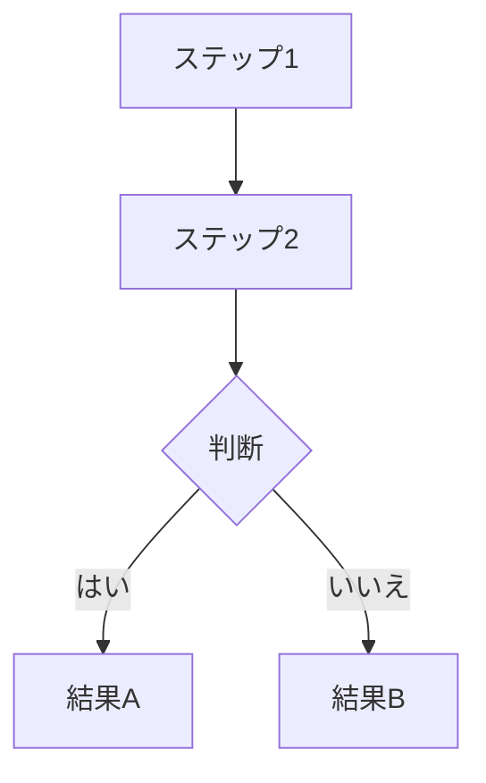
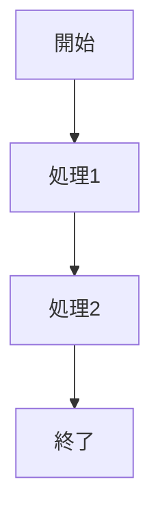
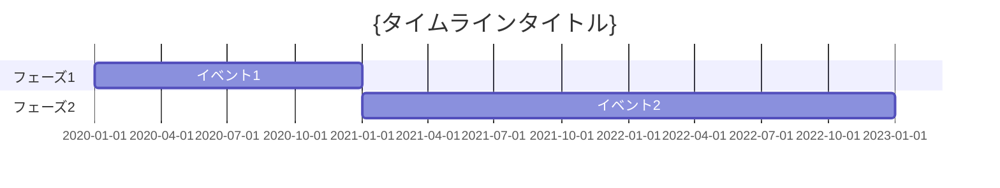
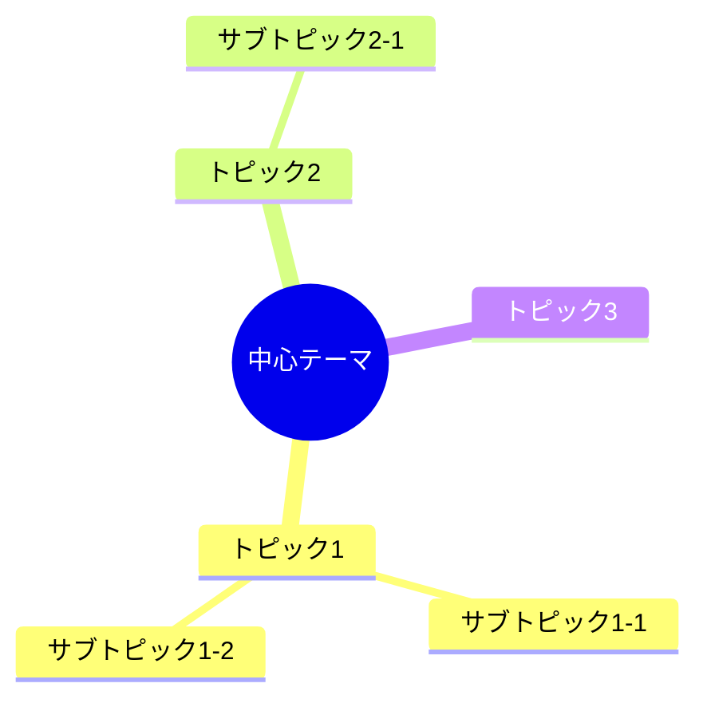

# Mermaid コード集 — {書籍タイトル}

## 使い方

各コードブロックをMarkdownファイルにそのまま貼り付けるか、
Mermaid Live Editor (https://mermaid.live/) でプレビュー・画像化できる。

---

## fig-{章番号}-{連番}: {キャプション}



---

## テンプレート集

### フローチャート（プロセス説明用）



### 比較表（Markdown表を使用）

```markdown
| 項目 | 従来の方法 | 新しい方法 |
|------|-----------|-----------|
| 特徴1 | {内容} | {内容} |
| 特徴2 | {内容} | {内容} |
```

### タイムライン



### マインドマップ


