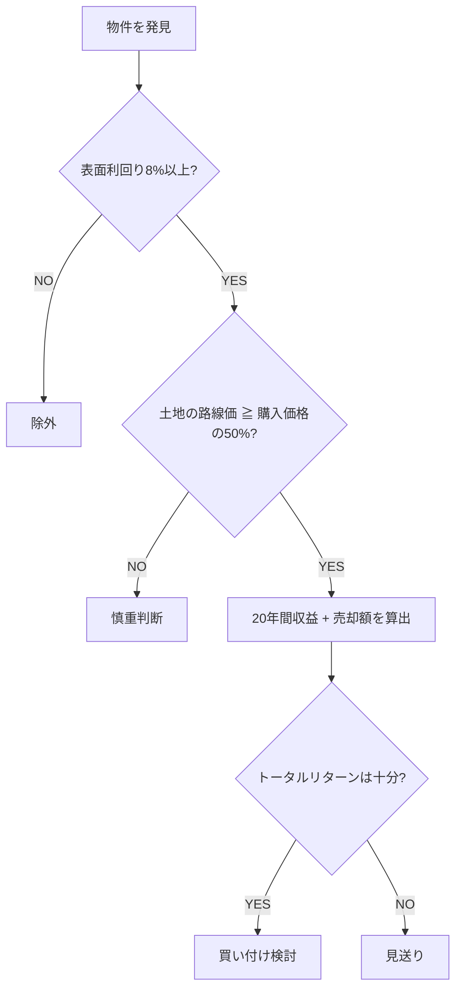

# 年収400万円から始める 中古アパート投資の教科書
## 月50万円の不労所得を実現する「正しいやり方」

**著者: キムニー（脱しじり不動産）**

---

## まえがき

「働いても働いても苦しい」

この言葉に、ドキッとした人がいるかもしれません。

毎朝、満員電車に揺られて会社に行く。残業して、疲れて帰ってきて、ご飯を食べて、寝る。月曜がまた来て、同じことの繰り返し。給料は上がらない。物価は上がる。年金がもらえるかどうかも怪しい。

──僕も、そうでした。

将来が不安で、夜中に目が覚めることもあった。このままで本当に大丈夫なのか。家族を守れるのか。老後はどうなるのか。答えが出ないまま、また朝が来て、また電車に乗る。

こんにちは、キムニーです。「脱しじり不動産」というYouTubeチャンネルを運営しています。

「しじり」って何？　と思われた方もいるでしょう。これは僕の造語で、「働いても働いても苦しい状態」のことです。まさに昔の僕自身がそうだった。普通のサラリーマンで、特別な才能もなければ、親がお金持ちなわけでもない。自己資金だって100万円程度しかありませんでした。

それが今、不動産を24棟保有して、家賃年収5,000万円、年間の利益で2,000万円、資産は5億円を超えるところまで来ました。20代からコツコツ積み上げてきた結果です。

──なぜ、こんなことが可能だったのか。

答えはシンプルです。「正しいやり方」を知って、その通りにやったから。ただ、それだけなんです。

不動産投資って、実は再現性がむちゃくちゃ高いんですよ。正しいやり方をすると、すごく結果が出やすい。繰り返し、繰り返し、何度もどんどん結果が出ていく。僕だけの話じゃありません。僕のスクールでは、5年間で1万人以上にセミナーを開催してきました。スクール生の成果報告は2,000件を超えています。中には、たった2年で月100万円の利益を達成した人もいます。

高収入の人だけが成功しているわけじゃない。属性がなくても、年収が400万円だろうと、自己資金が少なかろうと、正しくやれば結果は出る。69歳の年金生活者が始めて1年で年間利益1,000万円を達成した方もいる。パートで働きながら信用組合から融資を受けて物件を買った方もいる。僕自身がその証拠ですし、スクール生たちがその証拠です。

でも現実には、9割の人がうまくいかないとも言われている。それはなぜか？　正しいやり方を知らないまま、自己流でやってしまうからです。スポーツの世界だってそうじゃないですか。プロに教わらずに自己流でやって、結果が出るわけがない。こんなお金が絡む話なら、なおさらです。

この本には、僕がゼロから24棟を積み上げる中で得た知識と経験、そしてスクール生たちの実例を詰め込みました。

第1章では、サラリーマンがなぜ不動産投資をやるべきなのかをお話しします。株やNISAとの違いも含めて、不動産投資の優位性を伝えます。

第2章では、9割が失敗する理由を解剖します。失敗パターンを知ることで、恐怖を取り除いてほしい。

第3章と第4章では、「買ってはいけない物件」と「儲かる物件の探し方」を具体的に解説します。

第5章では、自己資金が少なくても融資を通す方法をお伝えします。「お金がないからできない」という思い込みを壊します。

第6章では、中古アパートで月50万円の不労所得を生み出す実践術。実際の収支モデルも公開します。

第7章では、月100万円に到達するためのロードマップを描きます。

そして第8章では、最新の選択肢として木造新築アパートの可能性にも触れます。

この本は「正しいやり方」の入り口です。読み終えたとき、「自分にもできるかもしれない」──そう感じてもらえたら、著者としてこれ以上うれしいことはありません。

難しいことは書いていません。専門用語が出てきたときは、その都度分かりやすく説明しています。最初から順番に読んでもいいし、気になる章から読んでもらっても構いません。

では、ページをめくってください。

---

## 第1章　サラリーマンこそ不動産投資を始めるべき理由

### 「投資は悪」だった時代

15年前、僕が不動産投資をやると周囲に話したとき、反応は散々でした。

親にも友達にも、「絶対やめとけ」「投資なんて悪に決まってる」と言われた。当時はそういう空気が当たり前だったんです。

それが今はどうでしょう。国の方針が「貯蓄から投資へ」に転換し、NISAが始まり、「投資しないとダメだよ」が常識になった。15年で180度変わりました。

でもね、ここで立ち止まって考えてほしい。世間が「投資は悪」と言っていた時代に、本当に投資は悪だったのか。不動産投資をする人って悪ですか？　皆さん、学生の頃アパートに住んだことがあるでしょう。その大家さんは「悪の仲間」でしたか？　違いますよね。人に住む場所を提供して、その対価として家賃をもらう。真っ当なビジネスですよ。

大事なのは「みんながこう言っている」というイメージじゃなくて、事実がどうなのかです。

ただ、15年前と今で決定的に違うことが一つあります。それは情報量。当時は不動産投資の情報を手に入れるのが本当に大変だった。今はYouTubeでもブログでも書籍でも、いくらでも情報がある。正しいやり方を知るためのハードルが、15年前とは比べものにならないくらい下がっているんです。

### 株・NISAではダメな理由

「でもキムニーさん、NISAでいいんじゃないですか？」

よく聞かれます。NISAは確かに悪くない。コツコツ積み立てて、利益に対する税金が優遇される。それ自体はいいことです。

ただ、冷静に数字を見てください。

毎月数万円を20年間コツコツ積み立てて、500万円が1,000万円になったとします。20年かけて500万円の利益。それで老後足りますか？　野菜の値段は上がる、社会保険料は上がる、年金は下がる。この時代に、20年間で500万円の増加では正直全然足りない。

しかもNISAは金融相場に投資するわけだから、暴落リスクがある。リーマンショック、コロナショック、覚えていますよね。2024年には日本の株式市場で史上最大の下落が起きて、翌2025年に最高値を更新した。乱高下がすごすぎて、はっきり言ってギャンブルに近い。

株式投資も同じ問題を抱えています。プロの投資家ですら年間の勝率は決まっているくらいの世界で、素人が安定して勝ち続けるのは無理がある。上がったり下がったりを繰り返す中で、メンタルを保ちながら利益を出し続けるのは至難の業です。

### 不動産投資が圧倒的に優れている5つの理由

**図1-1: 投資手法別の特徴比較──株・NISA・不動産**

| 比較項目 | 株式投資 | NISA（積立） | 不動産投資 |
|----------|----------|-------------|-----------|
| 毎月の安定収入 | なし | なし | あり（家賃） |
| レバレッジ（融資） | 不可 | 不可 | 可能 |
| 暴落リスク | 高い | 中程度 | 低い |
| 運用の手間 | 大 | 小 | 小（管理会社委託） |
| 実物資産 | なし（紙資産） | なし | あり（土地） |
| 20年後の期待リターン | 不確実 | 500万円程度 | 数千万円〜1億円 |

じゃあ、なぜ不動産なのか。理由は5つあります。

**1つ目──毎月安定した家賃収入がある**

株の利益は株価の上下だけ。キャピタルゲイン一本勝負です。でも不動産は違う。家賃収入（インカムゲイン）が毎月入ってくる。さらに、将来売却すれば売却益（キャピタルゲイン）も得られる。キャッシュポイントが2つあるんです。

しかも家賃収入は株価みたいに激しく動かない。5年、10年の単位で見ても、家賃というのは緩やかにしか変動しません。入居者が住んでいる限り、毎月決まった金額が振り込まれてくる。この安定感は、株にはない不動産だけの強みです。

**2つ目──暴落リスクが極めて少ない**

株が暴落しても保険は下りません。対策のしようがない。でも不動産は違います。火災保険にも地震保険にも入れる。リスクの種類が「出尽くしている」んです。空室、修繕、災害──全部対策ができる。種類が分かっているから備えられるんですよ。

一方で株は、日経平均が下がらないように「みんなで協力しましょう」なんてできないでしょう？　完全に外部要因に振り回される。不動産は自分でコントロールできる「経営」です。

**3つ目──レバレッジ（融資）が使える唯一の投資**

これが不動産投資最大の武器です。

株を買うのに銀行がお金を貸してくれますか？　貸してくれないですよね。株を資産として見たとき、金融機関の評価は非常に低い。自力でお金を用意するしかない。

ところが不動産は、土地と建物という現物があるから、金融機関が資産として認めてくれる。2,000万円の物件を買うのに、100万〜150万円の初期費用だけでフルローンが組める。同じ金額を株に投資しようと思ったら、2,000万円全額を自分で用意しなきゃいけない。

この差は本当に大きい。サラリーマンの信用力を使って融資を受けられるのは、不動産だけなんです。

「でも借金は怖い…」──分かります。日本では「借金＝悪」という空気が強い。でも冷静に考えてみてください。住宅ローンで家を買った人は、悪ですか？　違いますよね。ローンで不動産を買って、住む場所を人に提供して、家賃をもらう。住宅ローンとやっていることは同じなんです。むしろ住宅ローンは自分のポケットからお金が出ていくだけですが、不動産投資のローンは入居者の家賃で返済していく。お金の流れが真逆なんですよ。

**4つ目──運用の手間が非常に少ない**

「でも大家って大変そう…」と思った方。実は、サラリーマンをやりながらでも十分できます。管理会社に任せてしまえば、自分がやることは月に数回の確認程度。本業に支障が出ることはほぼありません。

株のデイトレードのように、日中ずっと画面を見ている必要なんてない。会社で働きながら、家賃が振り込まれるのを待っていればいい。まさにサラリーマン向きの投資なんです。

**5つ目──土地という現物資産が残る**

株は企業が倒産すれば紙くずです。でも不動産は、建物が古くなっても土地は残る。物価が上がる時代に、現金を持っていると価値が目減りする。うまい棒が10円から30円になったら、100円の価値は3分の1になってるわけですよ。

でも土地は「物」だから、物価が上がれば一緒に価値が上がる。金（ゴールド）の価格が上がるのと同じ理屈です。物価高の時代には、現金を物に変えるのが正解。不動産は、まさにその「物」なんです。

### 具体的な数字で見る不動産投資の破壊力

ここで、実際の数字を使ってシミュレーションしてみましょう。

**【ケース1】5,000万円のアパートをフルローンで購入**

- 購入価格: 5,000万円（フルローン）
- 利回り: 12%（年間600万円・月50万円の家賃収入）
- ローン: 25年・金利2.8%（返済月23万円）
- 経費: 約15%（月7万円）
- **毎月の純収益: 約20万円（年間240万円）**

毎月20万円が、本業の給料とは別に入ってくる。年間240万円。25年間で6,000万円です。

さらに、25年後に売却したらどうなるか。築年数が経っても、利回り15%で計算すると4,000万円で売れる。

25年間の収益6,000万円 + 売却4,000万円 = 1億円。

初期費用として払ったのは諸費用の400万円程度です。400万円が1億円になる。税引き後でも約17.5倍。こういうことが、不動産では普通に起こりうるんです。

**図1-2: 5,000万円アパート投資の25年間収支シミュレーション**

| 項目 | 数値 |
|------|------|
| 購入価格 | 5,000万円（フルローン） |
| 利回り | 12%（年600万円） |
| ローン返済 | 月23万円（25年・金利2.8%） |
| 経費 | 月7万円（15%） |
| 毎月の純収益 | 約20万円 |
| 25年間の累積収益 | 6,000万円 |
| 売却額（利回り15%時） | 4,000万円 |
| **トータルリターン** | **1億円** |
| 初期投資（諸費用） | 400万円 |
| **倍率** | **約17.5倍** |

**【ケース2】300万円の古民家からスタート**

「5,000万円なんて、いきなりは怖い」という人もいるでしょう。じゃあ、もっと小さい物件から始めるケースも見てみましょう。

- 購入価格: 300万円 + リフォーム100万円 = 投資額400万円
- 利回り: 15%（年間60万円・月5万円の家賃収入）
- ローン: 15年・金利2%（返済月2.5万円）
- 経費: 約10%（月6,000円）
- **毎月の収益: 約2万円（年間24万円）**

月2万円。「少なくない？」と思うかもしれません。でも15年間で360万円の収益。さらに売却時、入居中で利回り10%で計算すると600万円で売れる。

15年間の収益360万円 + 売却600万円 = 960万円。税金を差し引いても約700万円。初期費用30万円程度が、約23倍になる計算です。300万円の古民家でも、これだけの破壊力があるんですよ。

**【ケース3】年間240万円の収益で雪だるま式に増やす**

年間240万円の収益があると、2年で480万円が貯まります。これをもう1棟の頭金に充てる。2棟目がまた月20万円の収益を生む。今度は2棟合わせて月40万円。1年ちょっとで次の物件が買える。

2棟で1億円、4棟で2億円、6棟で3億円、10棟で5億円──。足し算で積み上げていけるんです。株と違って暴落で一気に失うことがない。不動産は「足していける仕組み」なんですよ。

しかも金や株と違うのは、この20倍のリターンを最後にドカンと受け取るんじゃなくて、毎月の家賃収入として早い段階から受け取れるということ。生活が楽になるのを実感しながら資産を増やせる。これが不動産投資の最大の魅力です。

### 物価高・金利上昇は味方になる

「でも今、金利が上がってるんじゃないですか？」

心配する人がいますが、実はこれ、不動産投資にとっては追い風なんです。

金利が上がると住宅ローンの負担が増えるから、家を買う人が減る。買えない人は賃貸に流れる。賃貸需要が増えると家賃が上がる。家賃が上がれば大家の利回りが上がる。金利の上昇分以上に収益が伸びることだって十分にあり得る。

物価高も同じです。現金で持っていたら価値が目減りするだけ。消費税は3%から10%になり、社会保険料は年々上がり、食料品の値段も上がり続けている。バブル期と比べて、同じ年収でも手取りが80万〜100万円少ないという試算もあります。

だったら現金を「物」に変えたほうがいい。不動産は「物」です。物の価値が上がる時代に、物を持っている人が勝つ。

### 「人口が減るから不動産はダメ」は本当か？

もう一つ、よく聞く反論があります。「日本は人口が減っていくのに、不動産投資なんて大丈夫なの？」

確かに日本全体では人口は減っています。でも、全国一律に減っているわけじゃない。過疎地域から都市部へ、人口は集中しているんです。

ただし、東京・大阪・福岡の都心は価格が高すぎて利回りが取れない。狙い目は郊外のターミナル駅や再開発が進んでいるエリア。たとえば藤沢の1駅隣の駅──こういう場所の土地が高くなっていることを知っているのは、そこに住んでいる日本人だけです。外国人投資家はテレビで見た都心の情報しか持っていない。

ここに、日本に住んでいるサラリーマンの圧倒的な優位性があるんです。

しかも海外不動産を買おうとすると、日本の金融機関は資産として認めてくれない。融資が出ない。頭金も高い。他の金融機関からの評価も下がる。わざわざ海外に手を出す理由がありません。

日本に住んで、日本の金融機関の融資を使って、日本の郊外の落ち着いたエリアで物件を買う。日本人しか買わないような物件に、まだまだ収益チャンスが眠っている。これがサラリーマンの特権です。

### なぜ「今」始めるべきなのか

最後にもう一つ、大事な話をさせてください。

不動産投資の最大手ポータルサイト「楽待」の会員数は、12年前は2万人程度でした。それが今、推定で45万人を超えています。5年後、10年後には100万人になるかもしれない。

参入者が増えれば増えるほど、すでに物件を持っている人は有利になります。なぜなら、買い手が増えるから売却価格が上がるんです。5,000万円で買った物件が、5,000万円で売り出しても売れるかもしれない。

逆に言えば、遅くなればなるほど物件価格は上がり、利回りは下がっていく。知っているか知らないかで、数百万〜数千万の差がつく。

今この本を手に取ったということは、すでに一歩を踏み出しています。次の章では、「9割が失敗する理由」を掘り下げます。失敗パターンを先に知っておけば、怖いものはなくなります。

---

## 第2章　不動産投資の9割が失敗する本当の理由

### 「9割失敗」の正体

不動産投資は9割の人がうまくいかない──こんな話を聞いたことがあるかもしれません。

これ、半分は正しくて、半分は間違っています。

僕は5年間で1万人以上にセミナーをやってきて、スクール生の成果報告だけでも2,000件を超えています。その経験から断言できるのは、「正しいやり方をすれば再現性はむちゃくちゃ高い」ということ。繰り返し、繰り返し、結果が出ていく。

じゃあなぜ9割が失敗するのか。答えは単純です。間違った買い方をしている人が大半だから。そして、本当はもっとうまくいくはずだったのに途中でやめちゃったり、3年、4年、5年と投資が止まっちゃったりしている人が多いから。

失敗する人に2020年から2025年まで共通して言えること──それは「勉強不足」と「自己流」です。

「自己流は事故る」という言葉がありますが、まさにその通り。自己流で金メダル取れたスポーツ選手がいますか？　コーチもなしに。スポーツの世界ですらそうなのに、何千万円というお金が絡む不動産投資を自己流でやろうとするのは、冷静に考えたらおかしい話です。

この章では、僕が2,000人以上のスクール生を教えてきた中で見てきた「失敗パターン」を徹底的に解剖します。失敗パターンを知っておけば、それを避けるだけでいい。怖くなくなります。

### 失敗する人の7つの思考・行動パターン

**図2-1: 失敗する人の7つの思考・行動パターン**

| # | パターン | 一言まとめ |
|---|----------|-----------|
| 1 | 人のせいにする | 他責マインドで判断力が育たない |
| 2 | 自己分析をしない | 資産状況を把握せず購入 |
| 3 | 目的を決めない | 所有欲で判断がブレる |
| 4 | マイルストーンを決めない | 目標なしにフラフラ迷走 |
| 5 | 物件情報を先に調べる | 融資可能な条件を知らない |
| 6 | 金融機関情報を知らない | 使える銀行を知らず諦める |
| 7 | 出口を決めない | 売却タイミングを逃す |

**パターン1──人のせいにする**

「僕が買ったのは、〇〇不動産がいいよって勧めてきたからなんです」

こういう人、めちゃくちゃ多いんです。不動産屋がこう言ってたから。友達に勧められたから。ネットにこう書いてあったから。全部、人のせい。他責マインドです。

成功する人は違います。「自分が責任を持って選んだ」と言える。なぜこの物件が大丈夫なのか、自分の口で説明できるまで理解してから買う。

別にあなたのせいだって責めたいわけじゃないんです。そうじゃなくて、「自分で理解して自分で決めた」と言える自分になるために、ちゃんと勉強してほしいということなんですよ。他責の人は理解しようとしないから、明らかに問題のある物件でも見抜けない。それが一番怖い。

**パターン2──自己分析をしない**

自分の資産状況、使える自己資金、ライフプラン──これらを考えないまま、言われるがまま買ってしまう人がいます。

「この物件を持っていれば安心ですよ」「価値が上がるに決まっています」。こう言われてOKしてしまう。でも冷静に考えてください。その物件は本当に利益を生み出しますか？

「利益が出たら税金がかかるじゃないですか」って言う人もいるんですが──いいじゃないですか。利益のうちの一部で税金を払ったとしても、残った分は全部あなたのリターンなんだから。利益が出ない物件を買うほうがよっぽど問題です。

**パターン3──目的を決めない**

「何のために不動産を買うのか」。この問いに答えられない人が意外と多い。

特に不動産投資で邪魔になるのが「所有欲」です。収支トントンでも、あの物件を持っている自分が誇らしい。友達に自慢できる。──それ、投資じゃなくて趣味ですよね。

目的は「利益を生み出すこと」。ここがブレると、判断がすべて狂います。

**パターン4──マイルストーンを決めない**

具体的な数値目標と時間軸がない人は、フラフラと迷走します。

「4年後に月50万円の利益」「7年後に月100万円」──こういうマイルストーンがあれば、利益を生まない不動産なんて買っている暇がないと分かるはず。

今の年収が800万円だとして、7年後に年収2,000万円になりますか？　会社勤めでは普通なりませんよね。でも不動産だったら、それができるんです。マイルストーンがあれば、そのために何を買うべきかが見えてきます。

**パターン5──物件情報を先に調べる**

これは順番の問題です。多くの失敗する人が「まず物件を探して、融資してくれる銀行は後から見つければいい」と考えている。

これ、たとえるなら、相手が「バッグが欲しい」って言っているのに、「とりあえず女性が好きそうなものを売っている百貨店に行けば何かあるはず」と言っているようなものです。

正しい順番は逆。まず「自分はどんな金融機関が使えるか」「その金融機関はどんな物件を好むか」を理解してから物件を探す。この順番を間違えると、どんなにいい物件を見つけても融資が通らないという悲劇が起こります。

**パターン6──金融機関情報を知らない**

パターン5と連動しますが、金融機関の情報を知らずに動く人が本当に多い。結果として「こんなことうまくいくのは属性がいいエリートサラリーマンだけだ。俺には向いてない」と勝手に諦めてしまう。

違うんです。金融機関の選び方を知らないだけなんです。

**パターン7──出口（売却戦略）を決めない**

「20年ローンを組んだら20年間売っちゃいけない」──こう思い込んでいる人がいますが、大きな誤解です。

「この物件は5年後に売ろう」「この物件は10年経営したら売ろう」と、買う時点で出口を決めておく。これができないと、売却のタイミングを逃して、その不動産と心中するしかなくなります。

買う時に売る時のことを考える。これが経験者と初心者の決定的な違いです。

### 新築ワンルームマンション投資の罠

失敗パターンの中でも最も被害者が多いのが、都心の新築ワンルームマンション投資です。はっきり言います。これは儲かりません。

「周りで不動産投資をやっている人」に聞いてみてください。「ワンルームなら持ってるよ。節税対策って言われて買ったんだけど、全然儲かんないよあれ」──こんな答えが返ってくるはずです。

考えてみてください。節税対策ということは、利益が出ないということです。利益が出たら節税にならないじゃないですか。つまり最初から「儲からない商品」として設計されているんです。

しかも高いものを買って儲けようとしている時点で、ロジックがおかしい。

新築ワンルームマンションの現実はこうです。

物件価値は年々下落する。RC造で47年かけて建物価値がゼロになる。売買相場も連動して下がっていく。家賃収入も年々下がる。サブリース契約（空室保証）がついていても、家賃が固定される保証ではありません。数年ごとに家賃は見直され、実質的には値下げされていきます。

30年後にはどうなるか。累計の赤字と売却損を合わせると、何も残らない。30年間ずっと持ち続けて、最後に残るのはゼロ。

じゃあ誰が儲かったのか？　不動産屋です。高い価格で売った販売会社と、サブリース契約をした管理会社。この2つはだいたい親会社と子会社の関係になっていて、両方が儲かる仕組みになっている。

本来、大家さんが儲からなきゃおかしいのに、なぜ大家さんが損をするのか。それは僕たちのリテラシーが低すぎるからです。

これを聞いて「だから不動産投資は危ないんだ」と思う人がいるかもしれませんが、違います。不動産投資が危ないんじゃなくて、あなたの選んだ物件が危ないんです。

### 実例で見る失敗──横浜・築20年アパートの悲劇

もう少し具体的な失敗事例を見てみましょう。

横浜市にある築20年のアパート。利回り9%、満室、5,000万円台。パッと見ると悪くなさそうに見えます。

でも、ここには複数の落とし穴がありました。

**落とし穴1──「横浜」のイメージに騙される**

横浜と聞くと、海、おしゃれな街並みを想像しますよね。でも不動産投資の経験者は「横浜」と聞いて何を連想するか。山と坂道です。横浜市の大半は山と坂道なんですよ。

しかもこの物件、駅から徒歩16分。たかが1分の差に見えるかもしれませんが、ポータルサイトの検索条件は「徒歩15分以内」で区切られています。16分だと検索結果に出てこない。入居者がそもそも物件を見つけられないんです。

**落とし穴2──競合が多すぎる**

「東京は高いから横浜を狙おう」──同じことを考える投資家が大量にいます。結果、横浜には新築アパートが乱立している。築2年、3年、4年と新しい競合がどんどん建っていく中で、築20年のアパートが勝てるわけがない。

**落とし穴3──家賃のバラつき**

レントロール（各部屋の家賃一覧）を見ると、3万4,000円の部屋もあれば5万1,000円の部屋もある。このバラつきは「家賃を下げないと入居者が入らなかった」証拠です。5万円で入居中の人が退去したら、次は3万5,000円まで下げないと埋まらない。

表面利回り9%は、数年後には6.8%まで下落する計算になります。

**落とし穴4──土地価値の無視（最大の問題）**

そしてこれが一番致命的な問題。5,000万円で買ったこの物件の土地の路線価を調べたら、たった1,500万円しかなかった。

築20年ということは、木造なら残り2年で建物価値はゼロになる。そのとき残るのは1,500万円の土地だけ。5,000万円で買ったのに、資産価値は1,500万円しかない。

利回りが6.8%まで落ちたから売ろうとしても、土地値が1,500万円では4,000万円でも3,000万円でも買い手がつかない。利回りという武器を失った以上、売りようがないんです。

満室であっても、利回りが良くても、土地の値段を無視して買ってしまっている人はすごく多い。「横浜だから売れるでしょ」──売れるか売れないかの問題じゃなくて、あなたが持っている資産の価値が全然足りていないんですよ。

### 成功事例との決定的な違い

同じ5,000万円台でも、まったく違う結果になる物件があります。

愛知県のある物件。利回りは同じ9%前後。5,000〜6,000万円。

何が違うのか。土地の路線価が7,000万円ありました。5,000万円で買った時点で、土地だけで2,000万円の含み益がある。本来なら9,000万円でも売れる物件を5,000万円で買えている。

融資期間も30年でほぼフルローン。手残りもしっかり出る。最終的にこの物件1つだけで、1億円近い利益が見込めます。

横浜の物件と愛知の物件。同じ価格帯、同じ利回り。でも結果は天と地ほど違う。この差は「土地値を見ているかどうか」だけです。

### 高学歴・高収入ほど引っかかる皮肉

面白いデータがあります。都心の新築ワンルームマンション投資に引っかかる人は誰かというと、偏差値が高くて、学歴もよくて、会社名も良くて、役職もある人なんです。

なぜか。今までうまくいってきたという自信があるから。「俺だったらいける」と思ってしまう。でもね、不動産投資と学歴は関係ない。勉強したかしてないかの世界なんです。

それは受験勉強に似ています。頭のよし悪しじゃなくて、この仕組みを理解したかしてないか。学んだか学んでないかによって大逆転が起こりうる。逆に言えば、エリートだろうと学んでいなければ失敗する。

### 失敗を知ることの本当の意味

ここまで読んで「うわ、不動産投資って怖い…」と感じた人がいるかもしれません。

でもね、一番怖いのは失敗パターンを知らないまま、成功事例だけを見て飛び込んでしまうことなんです。失敗事例を知って「怖い」と感じて完全に撤退してしまう人は、恐ろしくもったいない。

失敗パターンを知っていれば、それを避ければいい。避けた先に、成功のパターンが待っている。

スポーツの世界を見てください。プロの選手は、自分の弱点を徹底的に分析してから練習メニューを組みます。弱点を知らないで「がむしゃらに頑張る」だけでは、いつまで経っても上達しない。不動産投資も同じです。この章で紹介した失敗パターンは、あなたの「練習メニュー」の出発点。ここから逆算して「じゃあ自分はどうすればいいか」を考えることが、成功への最短距離です。

次の章では、「絶対に買ってはいけない物件」の具体的な見分け方をお伝えします。地雷物件を見抜く目を、一緒に鍛えていきます。

---

## 第3章　こんな物件に手を出すな！買ってはいけない物件の見分け方

### ワンルームマンション投資の「致命的な欠点」

第2章で新築ワンルームマンション投資の危険性に触れましたが、もう少し深掘りします。なぜなら、これに引っかかる人が本当に多いからです。

区分マンション投資には、構造的で致命的な欠点があります。それは「土地がない」こと。

マンションの一室を買うということは、土地をみんなで分け合っている状態です。50世帯が住んでいれば50分の1。実質的に土地の権利なんてあってないようなもの。建物の価値でしか売買されないんです。

ここに、区分マンション投資の弱さの根本があります。

世の中は「土地取りゲーム」なんですよ。マンション取りゲームじゃない。日本人が都心の土地がないものを買ってどうするんですか。外国人投資家が日本の土地を買い漁っている時代に、同じ日本人が土地のない区分マンションを買っている。冷静に考えておかしいですよね。

**価格の上乗せ構造**

「節税対策できますよ」「老後の準備になりますよ」──こう近づいてくる業者がいます。でも冷静に考えてください。節税対策ということは、利益が出ないということ。その時点で、投資としておかしいですよね。

しかも業者は価格を上乗せして売っている。本来2,000万円で買えるものを2,500万円で買わされている可能性がある。節税対策という入り口の時点で、利益度外視の価格設定になっているんです。

僕の基準では、都心のワンルームマンションで新築利回り7〜8%なら選択肢になり得る。でも実際に業者が売るのは利回り4〜5%の物件ばかり。投資は利回りで決まるんです。利回りが低ければ利益は出ない。

**建物価値は下がり続ける**

RC造（鉄筋コンクリート）の法定耐用年数は47年です。47年かけて建物の価値がゼロに向かって下がっていく。都心だから買った値段で売れ続ける、ましてや値上がりするなんて、どうしてそんな発想になるのか。

家賃も下がります。新築で入居した人が退去すれば、次の家賃は下がる。最初はローン返済とトントンだったのが、家賃下落で赤字に突入する。売却しても赤字の埋め合わせにしかならず、結局お金は残らない。

**建て替えはほぼ不可能**

「古くなったら建て替えればいい」──そう思うかもしれませんが、現実はそう甘くない。区分所有法では、所有者の5分の4が同意しないと建て替えできません。

古くなったマンションには高齢者が住んでいます。「今更引っ越しなんて無理」と反対する。外国人所有者が増えて連絡が取れない。よほど運がよくない限り、建て替えの同意は取れません。

しかもスクール生の実例では、修繕積立金が不足して「所有者全員に1人200万円払ってください」という通知が来たケースもあります。突然の200万円。予定外の出費です。

さらに深刻なのが、築50年超のマンションで外国人所有者が増えているケースです。海外に住んでいて連絡が取れない。建て替えの議案を出しても議決に参加してくれない。管理組合すらまともに機能しなくなる。これは特殊なケースじゃなくて、今後どんどん増えていく問題です。

**空き家は東京が最多**

「都心なら入居者は困らない」──これも幻想です。2023年時点で日本全国に900万戸の空き家がありますが、空き家が最も多い都道府県は実は東京都なんです。マンションの空き家だけで14万世帯以上。地方の問題じゃない。都心でも起きていることなんですよ。

### 中古戸建ての落とし穴

次に、中古戸建て投資の注意点です。特に「築古戸建て」は利回りが高くて魅力的に見えますが、落とし穴があります。

**再建築不可物件と借地権物件**

「再建築不可」──これは文字通り、今の建物を壊したら新しい建物が建てられない物件です。接道義務を満たしていない、道路の幅が足りないなどの理由で再建築できない。

「借地権」──土地の所有権がなく、お寺や地主から土地を借りている状態の物件です。

この2つは、原則として手を出さないほうがいい。再建築不可を頑張って再建築可にするという話も聞きますが、めちゃくちゃ時間がかかるし、運にも左右される。初心者が手を出す領域じゃありません。

僕自身は大阪まで行って利回り100%の再建築不可物件を買ったことがあります。でもこれは「相当安く買えたからペイする」という計算があったから。しかも買い付けの場面では中国人投資家と激しい争いになりました。こういう物件は経験を積んでからの話であって、1棟目・2棟目で手を出すものではありません。

**駅近プレミアムの罠**

「駅近の物件がいい」──これ、一概には言えません。

戸建ての入居者はファミリー層が中心です。ファミリーが求めるのは、小学校や公園が近いこと、静かな住環境。駅前の繁華街に住みたいファミリーは少ない。車社会のエリアなら、駅近のメリットはほぼゼロです。

具体的な数字で見てみましょう。

**郊外の戸建て（駅から遠い）の場合：**
- 購入価格300万円 + 修繕150万円 = 投資額450万円
- 年間家賃66万円
- 修繕費込み実質利回り：14.6%

**駅近の戸建ての場合：**
- 購入価格700万円（駅近プレミアム）+ 修繕150万円 = 投資額850万円
- 年間家賃66万円（同じエリアなので家賃は変わらない）
- 修繕費込み実質利回り：7.7%

築45〜50年の物件で利回り7.7%では、投資家は買いません。出口が詰まるんです。

駅の強さも重要です。再開発が進んだターミナル駅なら話は別ですが、地方の小さな駅の駅前物件に高いお金を払うと、売却時に買い手がつかない。利回りという武器がなければ、投資家は見向きもしません。

**出口を先に考える**

戸建ての売却先は大きく3つ。投資家に売る、実需（住む人）に売る、土地として売る。

投資家への売却が一番確実です。投資家は利回りで判断するから、数字が明確で出口が予測できる。「利回り10%で売り出す＝660万円で売れる」という計算が成り立つ。しかも、仮にこの戸建てを10年間賃貸に出していたとしたら、家賃66万円×10年＝660万円の収益が入った上で、さらに660万円で売却できるわけです。合計1,320万円。初期投資450万円の約3倍。10回転すれば、理論上は7,800万円の利益になります。

実需への売却は、「綺麗か」「住みやすいか」という感覚的な判断になるので、価格も時期も読めない。株に賭けるのと同じです。

土地として売るのは、更地にする費用がかかる上に、駅が弱いエリアでは土地の需要がない。2年売れない間に投資がストップして、機会損失が膨らむ。

### 築年数で気をつけるべきライン

中古アパートの場合、築年数ごとに特徴が変わります。

**築15〜20年──安定経営ゾーン**

ガス給湯器やエアコンは10年前後で壊れますが、築15〜20年の物件なら前のオーナーが一度交換していることが多い。次に壊れるまでまだ時間がある。キッチンやトイレもまだそこまで古くない。外壁や屋根の大規模修繕もまだ来ていない時期です。

仮に大規模修繕が築35年まで持つとして、築15年で買えば20年間は大きな出費なしで経営できる。安定経営を目指すなら、この築年数帯が最も手堅い。

**築30〜50年──高利回りだが修繕スキル必須**

築古になるほど価格が安くなるので利回りは高くなります。ただし修繕リスクは格段に上がる。

外壁のヒビを放置すると、水が浸透して木造なら腐る。腐った木にシロアリが来る。シロアリと雨漏りの組み合わせは最悪です。

僕自身、ゲリラ豪雨で1週間のうちに2物件で雨漏りが発生して、見積もりが200万円×2物件＝400万円だったことがあります。当時は修繕を安くする方法を知らなかったからローンを組んで払いました。でも運営スキルを身につけた今なら、200万円の見積もりを5万円で解決できることもある。知っているか知らないかで何百万も変わる世界です。

修繕費が安くできるスキルさえ持っていれば、築古のデメリットはほぼ消える。メリットだけが残る。だから僕はスクール生にも、修繕のスキルを先に身につけることを強く勧めています。

**和式トイレ・外置き洗濯機は要注意**

築30年超の物件では、和式トイレや洗濯機置き場が外にある物件がよくあります。これらを現代仕様に変更するコストは大きい。物件を見るときに、こういった設備の仕様は必ずチェックしてください。

### なぜ木造アパートがRCより有利なのか

「鉄筋コンクリート（RC）のほうが丈夫で安心じゃないですか？」

そう思いがちですが、投資としてはアパート（木造）のほうが有利です。

**購入価格の差**

RCは高い。1億5,000万円のRC1棟を買う代わりに、3,000万円の木造アパートなら5棟買える。リスクを分散できるし、1棟が空室になっても他の4棟がカバーしてくれる。

**修繕費の差**

RCの外壁修繕は足場だけで1,000万円を超えることがある。木造アパートなら100万〜400万円のレベル。特に2階建てなら足場のコストが大幅に安くなります。3階建てだと足場費が余分にかかるので、原則として2階建てを選ぶのがお勧めです。

**売却のしやすさ**

2000年代はRCにバンバン融資が出ていた時期がありましたが、今はその融資が出にくくなっています。融資が出ない＝買い手が少ない＝売りにくい。

木造アパートは小ぶりなので、様々な金融機関が対応してくれるし、現金で買う人もいます。出口の選択肢が広いんです。

**共用設備が少ない**

RCにはエレベーター、オートロック、宅配ボックス、屋上の給水タンクと汲み上げポンプなどの共用設備がありますが、木造アパートにはほとんどない。エレベーターの定期メンテナンスだけでも相当な費用がかかりますし、給水ポンプが故障したら全室の水が止まる。RCは「大規模修繕の倉庫」みたいなものなんです。設備が少ないということは、維持費が少ないということ。シンプルな構造の木造アパートが、投資としては圧倒的に有利です。

**図3-1: 木造アパート vs RC（鉄筋コンクリート）投資効率比較**

| 比較項目 | 木造アパート | RC（鉄筋コンクリート） |
|----------|------------|---------------------|
| 1億5,000万円で買える棟数 | 5棟（各3,000万円） | 1棟 |
| 外壁修繕費 | 100万〜400万円 | 1,000万円超 |
| 共用設備 | ほぼなし | エレベーター、給水ポンプ等 |
| 解体費用 | 100万〜200万円 | 2,000万円超 |
| 融資のしやすさ | 幅広い金融機関が対応 | 対応金融機関が減少傾向 |
| リスク分散 | 5拠点に分散可能 | 1拠点に集中 |

### 買ってはいけない物件チェックリスト

この章の内容をまとめると、以下のような物件には手を出さないでください。

1. 新築ワンルームマンション（特に「節税対策」として勧められるもの）
2. 利回り5%以下の物件
3. 再建築不可物件、借地権物件
4. 土地の路線価が購入価格を大幅に下回る物件
5. 駅から徒歩16分以上（ポータルサイトの検索に引っかからない）
6. 競合が乱立しているエリアの築古物件
7. 修繕積立金が極端に安いマンション
8. 3階建て以上のアパート（足場コストが高い）
9. 和式トイレ・外置き洗濯機など、仕様変更コストが大きい物件
10. RCの築古物件（修繕費が莫大・売却しにくい）

この10項目を頭に入れておけば、地雷物件はかなり避けられます。

最後に一つ、補足しておきます。「じゃあ築古は全部ダメなのか」というと、そうではありません。

たとえば、天窓がある物件は25年目あたりから雨漏りが始まるリスクが高い。でも天窓がない物件ならそのリスクは低い。3階建ては足場が高いけど、3階建てで屋上に階段で直接上がれる構造なら、足場なしで屋根の修繕ができることもある。

結局、「この物件の弱点は何か」「その弱点に対処するスキルが自分にあるか」──この2つで判断すべきなんです。初心者のうちは弱点が少ない物件を選ぶ。スキルが上がったら、他の人が避ける物件を安く買って高利回りで回す。これがステップアップの流れです。

では、避けるべき物件が分かったところで──いい物件はどうやって見つけるのか。次の章で解説します。

---

## 第4章　儲かる物件の探し方──ポータルサイト活用術と物件評価の鉄則

### ポータルサイトは「全部使う」

**図4-1: ポータルサイト別の特徴と使い分け**

| サイト | 特徴 | 向いている用途 | 対象レベル |
|--------|------|---------------|-----------|
| 楽待 | 最大手、業者からの提案機能あり | 初心者の入り口、幅広い物件探し | 初心者〜 |
| 健美家 | 実務的検索条件、エリアレポート | 利回り重視の絞り込み、相場把握 | 中級〜 |
| スーモ/ホームズ | 居住用物件として掲載 | ボロ戸建て探しの穴場 | 初心者〜 |
| 不動産会社自社サイト | ポータル掲載前の先行情報 | 競争の少ない物件発掘 | 中級〜 |

「キムニーさん、物件を探すのにどのサイトがいいですか？」

答えは──全部です。一つに絞るという発想が甘い。

不動産投資用の物件を探すためのポータルサイトは複数あって、それぞれ特徴が違います。目的に応じて使い分けるのが正解です。

**楽待（らくまち）**

日本最大の収益物件ポータルサイト。会員数は2025年時点で推定45万人。12年前はわずか2万人だったのが、20倍以上に増えています。

会員登録して年収などの個人情報を入力すると、不動産業者から物件提案が来る機能があります。初心者にとっては最も入りやすいサイトです。新着物件の更新スピードが早く、夜中に出てくる物件もある。コラムも充実しているので、勉強にも使えます。

ちなみに、登録するときにふざけたニックネームで登録するのはやめたほうがいい。「みやっち」とか「ぽんた」とかで登録している人がいますが、業者から「この人、本気じゃないな」と思われて、いい物件の提案が来なくなります。不動産業者も忙しい。本気度が低そうな人に貴重な物件情報を流したりしません。

楽待の直近1年間だけで約5万人の新規会員が増えています。ライバルはどんどん増えている。だからこそ、業者に「この人は本気だ」と思ってもらう必要があるんです。

**健美家（けんびや）**

中級〜上級者向けのイメージですが、初心者も使えます。利回り15%以上、価格変更あり、といった実務的な検索条件で絞れるのが強み。販売図面、土地の形状、接道状況、再建築不可かどうかまで確認できる。

さらに、エリアごとの利回り傾向や取引状況がレポートで確認できるので、不動産業者との交渉の根拠として使えます。「このエリアの相場はこれくらいですよね」と言えるわけです。

楽待と健美家は併用してください。両方を見ることで視野が広がります。1つに絞ろうという発想が甘い。全部使うんです。

**スーモ・ホームズ・アットホーム**

「え、スーモって賃貸のサイトでしょ？」と思った方。実はここにお宝が眠っています。

ボロ戸建てを探す場合、不動産業者は「収益物件」としてではなく「居住用住宅」として掲載していることがある。楽待や健美家には出てこない物件が、スーモやホームズに「中古一戸建て」として載っているんです。

ボロ戸建てを探すなら、むしろスーモやホームズがメインの狩り場になります。収益物件として認識されていないから、ライバルの投資家が少ない。ここに穴場がある。

**不動産会社の自社サイト**

ポータルサイトに掲載する前に、自社サイトに先行掲載する不動産会社もあります。自社サイトまで追いかける人は少ないので、競争が少なく有利です。気になるエリアの不動産会社のサイトは定期的にチェックしておきましょう。

### 毎日見続けることで「目」が育つ

ポータルサイトを毎日見続けていると、だんだん相場感覚が身についてきます。「このエリアで利回り8%はあり得ない」「10〜11%が相場だな」──こういう感覚が自然と養われる。

良い物件は一瞬で消えます。僕自身、楽待で埼玉県の500万円強の戸建てを見つけたとき、出た瞬間に買い付けを入れました。あっという間に消えた。なぜ即断できたかというと、あらかじめ「このエリア、この価格帯、この土地値以上」と条件を絞り込んでいたからです。「出たら即動く」──日頃から条件を絞り込んでブックマーク登録しておかないと、この一瞬に対応できません。

もう一つ大事なのは、不動産の情報は株と違ってインサイダーにならないということです。再開発情報は行政が公開しています。役所のホームページに載っている。「この駅の周辺が再開発される」という情報を先に知っていれば、そのエリアの物件を安いうちに買える。不動産では情報収集そのものが武器なんです。

### 利回りの正しい見方

ポータルサイトを見ていると、利回り50%なんていう物件が出てくることがあります。

「利回り50%！？　すごいじゃないですか！」

──ちょっと待ってください。その物件、駅から徒歩60分で周囲は田んぼだらけだったりしませんか？

ポータルサイトに載っている超高利回り物件は、不動産会社ですら「これは難しい」と判断して掲載しているケース。もし普通に運営できる物件なら、誰かがとっくに買っています。利回りが高すぎる物件は「売れ残っている理由がある物件」だと思ってください。

逆に、利回りは後から変えられないという事実も覚えておいてください。利回り4〜5%で買った物件は、後から8〜9%になることはありません。買った時点で、その物件の収益性はほぼ決まっているんです。

利回りの目安はこうです。

- 新築アパート：6〜7%以上（7%がラインで、これ以下は苦しい）
- 中古アパート：8〜10%以上（6%は低すぎる）
- 全般的に6%未満は原則除外

「利回り4〜5%の都心物件をいずれ高く売ればいい」──こう考える人がいますが、売るときも買い手は利回りで判断します。家賃が下がれば利回りはさらに低下し、値段を下げないと売れなくなる。「いずれ」が20〜30年後になったら、その間の人生を楽しめなかったことになります。

もう一つ注意すべきは、表面利回りと実質利回りの違いです。表面利回りは家賃収入を購入価格で割っただけの数字。経費も修繕費も含まれていません。第3章で触れたように、修繕費込みの利回りで判断しないと、買ってから「こんなはずじゃなかった」となります。

さらに忘れがちなのが購入時の諸費用です。仲介手数料、登記費用、不動産取得税、火災保険料──これらを合計すると、物件価格の7〜8%程度かかります。7,000万円の物件なら約500万〜560万円。この金額は融資に含まれないケースが多いので、自己資金として用意しておく必要があります。利回り計算をするときも、この諸費用を含めたトータルコストで考えてください。

### 物件評価の鉄則──「属性より物件の力」

**図4-2: 物件評価フロー──収益と資産のトータルで判断する**

「高収入じゃないとフルローンが下りない」

これ、大嘘です。僕自身、年収500万円台でスタートして、そこから10年かけずに家賃年収5,000万円まで来ています。

フルローンが出るかどうかは、あなたの年収じゃなくて「物件の力」で決まる部分が大きい。金融機関が見ているのは、あなたの給料明細だけじゃない。その物件がちゃんと収益を生むか、土地の資産価値は十分か──ここを見ているんです。

**収益と資産の両方を見る**

物件を評価するとき、「利回りが高いから買い」と即断してはいけません。収益と資産のトータルで考える必要があります。

たとえば3,000万円の物件で、20年間毎月8.3万円の利益が出るとします。年間100万円×20年＝2,000万円の収益。さらに売却時に2,000万円の手残り。トータル4,000万円の利益。

でも同じ3,000万円の物件でも、土地の路線価が500万円しかなかったらどうなるか。20年後に建物価値はゼロ。売れても500万〜1,000万円。結果として2,500万円が借りすぎ状態──債務超過です。

一方、土地の路線価が2,000万円ある物件を買った人は、20年後に1,500万円多く手に入る。買った時点のチョイスで、20年後の結果が決まるんです。

しかも、土地値が購入価格を大幅に下回っている物件を買うと、金融機関からも見抜かれます。「あいつ、だまされてるな」とバレるんですよ。金融機関は物件の担保評価をプロとしてやっている。土地評価を無視した買い方をしている人に、次の融資は出しません。1棟目の失敗が、2棟目以降のチャンスまで潰してしまう。だから最初の物件選びが本当に大事なんです。

**小戸建てを「共同担保」に使う裏技**

もう一つ、ポータルサイトで小戸建てを買う際のテクニックを紹介します。

500万円程度の小戸建てを現金またはフルローンで購入する。これ自体のリターンは小さい。でもこの物件の土地を「共同担保」として差し出すことで、次のアパート購入時にフルローンやオーバーローンが引ける場合があるんです。

小戸建てはそれ単体のリターンは小さい。でも1つの物件が次の物件への足がかりになる。点で見ると小さな利益でも、線でつないで見ると戦略になる。

**金利よりトータルリターン**

「金利が安い銀行を探さなきゃ」──この発想も要注意です。

金利3.8%でもトータルリターンが4,200万円になる物件と、金利2.8%だがトータルリターンが3,800万円の物件。どっちがいいですか？　金利が高いほうが儲かるケースは普通にあります。

金利の安さにこだわって融資先を選ぶより、「使える金融機関を使う」ほうが圧倒的に合理的です。

### 避けるべきエリアと物件タイプ

最後に、ポータルサイトで物件を見るときに避けるべきパターンをまとめます。

**大学だけに依存するエリア**

「学生向けアパートだから安定している」──これは危険です。大学のキャンパスが移転したり閉鎖したりすると、一瞬でアパートが空室だらけになる。実際に千葉大学あやめ台キャンパスが2008年に閉鎖されたとき、横浜市立大学のキャンパスが2019年に移転したとき、周辺アパートの家賃相場が崩壊しました。

学生以外の入居者がそのエリアに住みたいと思うか。この問いに「NO」なら、そのエリアは大学に依存しすぎているということです。

**市街化調整区域**

再開発のときに建物が建てられなくなる可能性がある上に、金融機関も融資を嫌がります。避けてください。

**賃貸供給過多エリア**

新築アパートが乱立しているエリアに築古物件を買うと、競争に勝てません。スーモやホームズで近隣物件の募集状況を検索してみてください。築浅の物件が何ヶ月も空室のまま掲載されていたら、そのエリアは供給過多です。

**地方のワンルーム物件**

地方でワンルーム（1K）は苦戦します。ファミリー向けの間取りなら対策の立てようがありますが、地方のワンルームは需要が限られます。

**車社会のエリアでの注意点**

もう一つ見落としがちなのが、車社会のエリアでは駅近の意味が変わるということ。東京や大阪なら駅近がプレミアムですが、地方では「高速インターチェンジに近いほうが人気」というエリアもある。駅近にこだわりすぎて高い物件を買うと、そのエリアの入居者には全くアピールしなかったりする。

事前に地元の管理会社に電話して、「このエリアの空室率はどれくらいですか？」「駅からの距離は入居率に影響しますか？」と聞いてみてください。「購入したら管理をお願いしたい」と伝えれば、親身に教えてくれます。地元の情報は、地元の人に聞くのが一番正確です。

物件探しは「数を見る」ことが命です。条件を絞り込んで、毎日サイトをチェックして、「これだ」と思ったら即動く。いい物件を見つけた後にぶつかる最大の壁は「融資」。次の章では、この壁の突破法を公開します。

---

## 第5章　自己資金が少なくても融資を通す方法

### 「お金がないからできない」は思い込み

不動産投資をやりたいけど自己資金がない──これが多くの人の最大の壁です。

でも僕自身、自己資金100万円程度のスタートでした。年収も500万円台。そこから24棟まで積み上げてきた。自己資金が少ないことは、不動産投資を諦める理由にはなりません。

ただし、最低限の種銭は必要です。まず500万円を目指してください。

**なぜ500万円なのか**

金融広報中央委員会の調査によると、500万円以上の貯金がある単身世帯の割合は、20代でわずか6.3%。30代で21.2%。40代で28%。50代で31.1%。60代でも42.7%しかいません。

つまり500万円を持っている時点で、すでに少数派なんです。500万円は「お金持ちの分岐点」と言ってもいい。ここを超えられるかどうかで、その後の人生のルートが変わります。

500万円があれば3つのことが変わります。

1つ目は選択肢が広がること。会社が潰れても次を探す余裕ができる。精神的な安定は判断力に直結します。

2つ目は無駄な支出が減ること。貯金の意味が分かると、お金の使い方が変わります。

3つ目は資産の増加スピードが上がること。500万円を不動産投資の種銭にすれば、家賃収入で貯金ペースが加速していきます。

「100万円貯まりました！」──おめでとうございます。でもそこで使いたくなる気持ち、分かります。でもね、貯めたお金を使い切るサイクルを繰り返しているうちは、人生は変わらないんです。100万円を通過点にして、500万円を目指す。「貯める→使う」を「貯める→増やす」に変えないと、一生ラットレースから抜け出せません。

**貯金だけの人、投資信託の人、不動産投資の人**

500万円の使い方で、人生がまったく変わります。

貯金だけの人は、60歳で1,000万円程度。そこから切り崩す老後。

投資信託で運用した人は、60歳で1,700万〜3,700万円になる可能性はあるが、暴落リスクがある。

不動産投資をした人は、家賃収入が入り続けるから、年金が足りなくても生活できる。資産を切り崩す必要がない。ローン完済後に物件を売れば2億〜3億円が入る。

この差は、500万円をどう使ったかだけの違いです。

具体的にシミュレーションしてみましょう。500万円を種銭に、5,000万円の中古アパートをフルローンで購入する。初期費用（物件価格の7%）は約350万円。手元には150万円が残ります。

利回り10%なら年間家賃500万円。返済と経費を引いて年間利益約75万円。投資利回りは350万円に対して75万円だから、約21%です。

この75万円を2年間貯めると150万円。手元に残した150万円と合わせて300万円。これが次の物件の種銭になる。2棟目を買って、また利益を積み上げる。5年後には3棟〜4棟、総資産1億円を超えている計算です。

「500万円で1億円」──大げさに聞こえるかもしれませんが、フルローンを使えばこのスピード感は現実なんです。

### 収益物件の融資は住宅ローンとは別物

まず大前提として、収益物件のローンと住宅ローンはまったくの別物です。

住宅ローンは、どこの銀行でも扱っていて、金利で比較すればいい。でも収益物件のローンは、そもそも使える金融機関が限られている。「金利が安いところを探す」という発想自体が間違いなんです。

そもそも金融機関に「不動産投資がしたいんですが」と言うのはNG。「投資」という言葉を聞いた瞬間、株や投資信託と同じカテゴリに入れられてしまう。正しくは「賃貸経営をしたいのですが」と言う。言葉一つで、窓口の対応がまったく変わります。

それでも金融機関から「うちは常連さんしかダメなんです」とガチャっと電話を切られることもあります。僕も何度もありました。でもそこで諦めたら終わりです。別の金融機関に当たる。ダメなら次。この「打席に立ち続ける姿勢」が融資を通すうえで一番大事なメンタルです。

金利1%だけど融資してくれない金融機関は使えません。金利3.8%でも融資してくれる金融機関のほうが、圧倒的に価値がある。

僕自身、金利7%のフリーローンで1,000万円を15年で借りたこともあります。金利が高くても、それを使って物件を買い、トータルで利益が出ればOKなんです。金利より「借りられるか」「返済期間が長く取れるか」のほうが重要です。

### 年収別の融資戦略

**図5-1: 年収別に使える金融機関と融資戦略**

| 年収帯 | 使える金融機関 | 主な戦略 |
|--------|--------------|----------|
| 2,000万円以上 | メガバンク、地方銀行 | 大規模RC・新築でフルローン |
| 1,000万円以上 | 地方銀行 | 中規模アパートでフルローン |
| 700万円以上 | 地方銀行、アパートローン | 新築アパート+アパートローン活用 |
| 500万円前後 | 信用金庫、信用組合、ノンバンク | 物件の資産価値重視で突破 |
| フリーランス等 | 信用組合、ノンバンク | 小戸建てから実績を積む |

「自分の年収じゃ無理でしょ」──こう思い込んでいる人が多いですが、年収に応じた戦い方があります。

**年収2,000万円以上：** メガバンクや地方銀行が使える。大規模なRCや新築アパートでフルローンを狙えるポジション。

**年収1,000万円以上：** 地方銀行が主力。中規模アパートでフルローンを狙う。

**年収700万円以上：** 地方銀行に加えて、アパートローン（銀行の企画商品で住宅ローンに近いもの）が使える。

**年収500万円前後：** ここからが面白いところです。年収をあまり見ない金融機関があるんです。信用金庫、信用組合、不動産担保型のノンバンク──これらは物件の資産価値を重視するので、年収が高くなくても融資が通る。

**フリーランス・パート・年金生活者：** 信じられないかもしれませんが、パートで働いている方が信用組合からお金を借りて不動産を買った実績もあります。69歳の年金生活者が始めて、1年後に年間利益1,000万円を達成した事例もある。

「年収が高くなきゃできないんだろう」じゃなくて、「年収が低くたって買ってやるよ」ぐらいのやり方はある。年収が低い方は、年収が高い人と同じやり方はできません。でも年収が低いなりの戦い方がある。それを知っているかどうかで結果は全く変わります。

将棋にたとえると、小さな戸建ては「歩」です。でも歩だって「金」に成れるでしょう。いきなり飛車（RC1棟2億円）で攻めなくていい。歩を使いこなして、少しずつ盤面を有利にしていく。全部の駒を使える人が最終的に勝つんです。

### フルローンを引き出す3つの条件

「高収入じゃないとフルローンが下りない」──これは大嘘だと前章で言いました。じゃあフルローンはどうやったら出るのか。

3つの条件が重なったときに出ます。

**条件1：物件の選び方**

土地の路線価が購入価格に見合っているか。資産価値が十分か。金融機関は物件の担保価値を見ています。土地値がしっかりある物件なら、フルローンの可能性が高まります。

**条件2：金融機関の選定**

収益物件に積極的な金融機関を選ぶ。すべての金融機関が収益物件に融資するわけではありません。物件の条件とマッチする金融機関を見つけることが「融資パズル」の核心です。

**条件3：自分から情報を開示する姿勢**

フルローンを引き出すには、自分から個人情報や財産状況を開示するぐらいの姿勢が必要です。「出せるものは全部出す」──それぐらいの覚悟がないと、金融機関も本気で検討してくれません。

この3つの条件が揃ったとき、何が起きるか。

3,000万円の物件をフルローンで購入した場合を計算してみましょう。自己資金は諸費用の約200万円だけ。年間利益が100万円出るとして、20年間で2,000万円。さらに売却時に土地値が2,000万円で残っていれば手残り2,000万円。トータル4,000万円のリターンです。

200万円を投じて4,000万円。投資利回りで言えば、20年間の平均で年利100%を超えます。このリターンが可能なのは、フルローンという仕組みを使った不動産投資だけなんです。

### 融資パズルの攻略法

銀行が融資するかどうかは、「どの金融機関が使えるか」「その金融機関がどんな物件を評価するか」「その条件を満たす物件を持っていけるか」──この3つの組み合わせで決まります。

RPGにたとえるなら、「炎の剣がどこに落ちていて、どんなモンスターに効果があって、どんなモンスターに使うと折れるか」を知っていれば攻略できるんです。

個人で金融機関に当たるだけでは、この情報は集まりません。お医者さんが論文やデータベースで最新の治療法を共有するように、コミュニティで「A銀行はこういう物件に出した」「B信用金庫はこういう属性でも融資した」という情報を共有し合うことで、攻略マップが完成する。

僕のスクールでは、2,000人以上のメンバーが毎月この情報を共有しています。どの金融機関がどういう条件で融資を出したか。そのデータの蓄積が、年収500万円の人でもフルローンを実現させている原動力です。

### 注意すべきこと──リボ払いは絶対やめる

一つだけ強く警告しておきます。クレジットカードのリボ払いは、今すぐやめてください。

リボ払いは金融機関から「消費性ローン」と見なされます。不動産を買うローンは「資産を買うローン」。リボ払いは「浪費のためのローン」。この2つは金融機関の中で全く違う扱いです。

リボ払いの残高があると、次の融資審査に悪影響が出ます。不動産投資を始めたいなら、まずリボ払いを完済するところからです。

同じく注意が必要なのが、高級時計や車のローンです。これらも「消費性ローン」です。不動産のローンは「ロレックスをローンで買って、しかもそのロレックスが毎月お金を生み出してくれる」ようなもの。他人の家賃で返済していくから、自分の負担は実質ほとんどない。この違いを理解していないと、金融機関との面談で的外れなことを言ってしまいます。

### 時間を味方につける──通勤時間の活用

「勉強する時間がない」──よく聞く言葉ですが、本当にそうですか？

毎日の通勤時間の前後30分を使えば、月30時間。年間360時間。1日5時間集中して勉強するのに換算すると約72日分です。さらに月に3回の休日を加えると、合計で年間108日分の勉強量になる。

24時間は総理大臣も大谷翔平もあなたも同じ。その24時間をどう使うかで、3年後が変わります。通勤電車の中で楽待をチェックする。健美家の新着物件を見る。その小さな積み重ねが、「出た瞬間に買い付けを入れられる目」を育てるんです。

### 実績が次の融資を呼ぶ

最初の1棟は大変です。でも1棟目を買って、ちゃんと経営できている実績ができると、信用金庫や信用組合が「事業者」として見てくれるようになります。

すると2棟目の融資が楽になる。2棟目の実績で3棟目がもっと楽になる。融資の世界にも雪だるま効果があるんです。

次の章では、いよいよ中古アパートで実際にどう収益を出すのか──月50万円の不労所得を生み出す実践術をお伝えします。

---

## 第6章　中古アパートで月50万円の不労所得を生み出す実践術

### 中古アパートが最強である3つの理由

ここまで「買ってはいけない物件」と「いい物件の探し方」をお伝えしてきました。じゃあ、結局何を買えばいいのか。

僕の答えは明快です。中古アパートです。

でもその前に、一つだけ聞いてほしいことがあります。

あなたが学生の頃に住んでいたアパートの大家さんは、悪人でしたか？　あなたは「悪の巣窟」に住んでいたんですか？　──違いますよね。大家さんは住む場所を提供して、対価として家賃をもらう。真っ当なビジネスです。

あなたが今働いている会社だって、利益を出しているからあなたに給料を払えている。利益を出さない会社で働きたいですか？　怖いでしょ。経営して利益を出すことは、悪いことじゃない。むしろ普通のことなんです。この心理ブロックを外しておかないと、せっかくのチャンスを逃します。

さて、中古アパートが最強である理由は3つあります。

その前に一つ、大事な前提をお伝えしておきます。「人口が減っているから賃貸需要も減るのでは？」と心配する方が多いですが、賃貸経営で大事なのは人口ではなく「世帯数」です。

3人家族が同居していれば家は1軒でいい。でも3人がそれぞれ一人暮らしを始めたら、3軒必要になる。日本の世帯数のピークはまだ来ていません。2030年までは世帯数が維持または増加するという公的データがあります。「人口減少＝賃貸ダメ」という単純な図式は成り立たないんです。

**理由1──利回りが圧倒的に高い**

中古アパートの利回りは10%、15%、20%も狙えます。新築都心ワンルームマンションの利回り4〜5%とは世界が違う。

利回り20%の物件を1棟買うだけで、毎月25万〜30万円のキャッシュフローが生まれる。しかも東京である必要がない。郊外のほうがむしろ利回りは高い。

実際に僕のスクール生で、1,000万円ちょっとの物件を利回り約30%で購入した人がいます。土地の価値は2,000万円以上あるので、売却時には3,000万円程度を見込める。利回りも資産価値も、両方取れている好例です。

**理由2──土地が最後に残る**

木造建物は築22年で法定上の建物価値がゼロになります。でも土地は残る。土地には「築年数に応じて価値がゼロになる仕組み」なんてありません。過疎地域でない限り、一定の価値は長期間維持されます。

具体的に計算してみましょう。土地の路線価が2,500万円以上ある場所にある中古アパート（6部屋、家賃4万円/室）を2,500万円でフルローン購入した場合。土地値と同等以下で買えている好事例です。

- 家賃収入：月24万円
- 返済：月12万円
- 経費：月4万円
- 毎月の利益：8万円
- 年間：96万円
- 20年間の累積収益：1,920万円

そして20年後、建物価値がゼロになっても土地は2,500万円で残っています。トータルで4,420万円。初期投資は諸費用の200万円程度です。

**理由3──家賃が実は安定している**

「中古って家賃が下がり続けるんじゃないですか？」

実は逆なんです。新築こそ家賃が下がり続ける。新築プレミアムが剥がれて、毎年少しずつ家賃が下落していく。

一方、中古は築20〜30年になると家賃の下落が止まる。下げ止まりがあるんです。設備的にこれ以上下げようがない、管理費や修繕費を考えると下げられない。中古のほうが実は安定している。

### 空室対策の極意──「コンセプト」と「ターゲット」で勝つ

**図6-1: ターゲット別コンセプト設計の考え方**

| ターゲット | コンセプトのキーワード | 具体的な施策例 |
|-----------|---------------------|---------------|
| ファミリー層 | 子供が喜ぶ暮らし | 人工芝+BBQスペース、公園情報 |
| 若いカップル | おしゃれに暮らせる空間 | 間接照明、ダブルベッド対応、美容院情報 |
| 男性シングル | クールでかっこいい空間 | ダクトレール照明、コンクリート調クロス |

中古アパートを買ったら、次に考えるのは空室対策です。でもここで大事なのは、単なる「差別化」ではなく「刺さる」ことです。

住宅街に真っ赤な家を建てても、目立つけど入居者は来ない。それは差別化であって、ターゲットに刺さっているわけじゃない。

ポイントは、入居者のターゲットを明確に定義して、そのターゲットに「ここに住みたい！」と思わせること。ライバルの大家さんたちは、この顧客視点のアプローチをほとんどやっていません。だからチャンスなんです。

そしてコンセプト化には、もう一つ大きなメリットがあります。家賃を上げられるんです。コンセプトなしで月3万円しか取れなかった物件を、コンセプト化で4万5,000円に引き上げられたらどうなるか。利回り10%の相場なら、売却価格も上がる。空室対策が出口戦略にまで効いてくる。この連鎖を意識している大家さんは、本当に少ないんですよ。

**ファミリー層を狙う場合**

ターゲットは若いカップルと子供1〜2人。このファミリーに刺さるのは何か。

まず近くの公園、ファミレス、イオン、バーベキューができるスポットを調べておく。それを内見時に伝えるだけで印象がまったく変わります。

さらに、庭に人工芝を敷いて椅子とテーブルを置く。「週末にバーベキューができますよ」と提案する。人工芝は1〜2万円、テーブルセットは2万円程度。合計5万円もかからない投資で、ファミリーの心をつかめる。

ファミリーの意思決定者は、実は子供です。「子供がここがいいと言ったら決定」。子供が喜ぶ仕掛けがあるかどうかで、成約率が変わるんです。

**若いカップルを狙う場合**

共働きのカップルが求めるのは、「おしゃれに暮らせる空間」。

ダブルベッドが入るスペースを確保して、間接照明を設置する。遮光カーテンをつける。これだけでモデルルームのような雰囲気になる。

さらに差がつくのが情報提供です。近隣の飲食店やカラオケだけじゃなく、美容院やネイルサロンまで調べておく。他の大家さんは美容院やネイルサロンまで調べません。「ここまで考えてくれている大家さんなんだ」と思わせたら勝ちです。

空室が長引いている部屋には、家電3点セット（電子レンジ・洗濯機・冷蔵庫）を備え付けるのも有効です。初期費用を抑えたい若いカップルには刺さります。中古家電で揃えれば、合計3万〜5万円程度。それで家賃を2,000〜3,000円上乗せできれば、1年半で元が取れます。

**内見時に差がつくポイント**

管理会社や仲介業者に「この物件の周辺情報をまとめた資料」を渡しておくのも効果的です。近くのスーパー、コンビニ、病院、学校、公園、飲食店──内見に来た人がその場で生活イメージを描けるかどうかで成約率が変わります。

ほとんどの大家さんはこれをやっていません。業者まかせです。だからこそ、やった人が勝つ。「ここまでしてくれる大家さんなんだ」と思わせたら、多少家賃が高くても選ばれます。

**男性シングルを狙う場合**

独身男性が求めるのは「クールでかっこいい空間」。

黒の照明にダクトレール。焦げ茶色やコンクリート風のアクセントクロス。浴室にも1面だけコンクリート調のクロスを入れる。黒い家電を揃える。

「女性を呼んでも恥ずかしくない部屋」──この訴求は男性シングルに確実に刺さります。

**物件名の付け方──0円でできる差別化**

意外と見落とされがちなのが、物件の名前です。「田中マンション」「山田ハイツ」──大家さんの名前を付けている物件が多いですが、入居者からすると何の魅力もありません。

物件名を付けるときのルールは3つ。

1つ目、大家さんの個人名は入れない。入居者に関係のない情報です。

2つ目、物件の色を名前に入れない。「グリーンハイツ」と名付けたら、将来外壁を別の色に塗り替えられなくなります。

3つ目、入居者目線で考えた名前にする。ターゲットがカップルなら洗練された響き、ファミリーなら安心感のある響き。たったこれだけのことで、ポータルサイトでの第一印象が変わります。0円でできるノウハウなんです。

**外壁塗装のついでにコンセプトを変える**

中古アパートを買って、外壁塗装の時期が来たとします。クリーム色の外壁をクリーム色に塗り直す──それ、もったいなくないですか？

どうせお金をかけて塗るなら、ネイビーや濃い色に変えてしまう。物件名も変えてしまう。それだけで「リニューアル物件」として打ち出せる。同じ塗装費用で、入居率も家賃設定もまったく変わるんです。

### 修繕費のコントロール──知っているかどうかで何百万も変わる

中古アパート経営で最も怖いのが突発的な修繕費です。でもこれは、コントロールする方法を知っていれば怖くありません。

まず月々の経費に、空室リスクと修繕費を平均化して組み込んでおく。毎月4万円の経費を見込んでおけば、突発的な出費があっても慌てなくて済みます。

木造アパートの主な修繕費の目安も把握しておきましょう。6〜8室規模の場合、外壁塗装は約100万円。屋根の塗装または重ね張りは約200万円。外壁と屋根をセットでやると300〜400万円。大規模修繕のタイミングは築30〜35年が一つの目安です。この金額を頭に入れておけば、「突然の出費」ではなく「想定内の出費」として対応できます。

そして何より大きいのが「修繕を安くする方法」を知っているかどうかです。

第3章でもお伝えしたゲリラ豪雨の雨漏りエピソード──あれは「修繕リスクの怖さ」の話でしたが、ここでの教訓は逆です。「修繕費はコントロールできる」ということ。見積もり200万円を5万円で解決できたのは、「どこに頼むか」「何をやるか」「何をやらないか」を自分で判断できるようになったからです。10分の1じゃなくて40分の1。この差は知識の差であって、運の差じゃありません。

ちなみに足場代も馬鹿にならない。2階建てなら足場のコストは大幅に抑えられますが、3階建てだと跳ね上がる。僕は足場って「無駄なお金」だと思っています。工事する方にとっては命を守る大事なものですが、投資する側からすると、足場が少なくて済む物件を選ぶべきなんです。だから2階建てが基本。

### 1棟で月20〜30万円の収益モデル

**図6-2: 中古アパート1棟の収支モデル（2,500万円・利回り約10%）**

| 項目 | 数値 |
|------|------|
| 購入価格 | 2,500万円（フルローン） |
| 家賃収入 | 月24万円（6室×4万円） |
| ローン返済 | 月12万円 |
| 経費 | 月4万円 |
| 毎月の利益 | 8万円 |
| 年間利益 | 96万円 |
| 20年間の累積収益 | 1,920万円 |
| 土地の残存価値 | 2,500万円 |
| **トータルリターン** | **4,420万円** |
| 初期投資（諸費用） | 約200万円 |

具体的な収益モデルを見てみましょう。

利回り9〜10%の中古アパートを2,000万〜3,000万円で購入し、20〜25年の融資を組む。毎月7万〜8万円の利益が1棟から生まれます。

「え、月7〜8万円？　50万円には程遠いじゃないですか」

そうです。1棟ではそこまでいきません。でも高利回りの物件（15〜20%）を1棟入れると、一撃で月25万円に達することもある。

たとえばこんな組み合わせはどうでしょう。

- 新築アパート（月7万円の利益）
- 中古アパート（月5万円の利益）
- ボロ戸建て（月4万円の利益）

これで月16万円。同じ組み合わせをもう1セット買えば月32万円。年間384万円です。

ここに利回り15〜20%の中古アパート（購入価格2,000万円程度）を1棟加えれば、それだけで月15万〜20万円のキャッシュフローが乗る。合計で月50万円に届くんです。

利回り20%の物件を「確変しっぱなしのドル箱物件」と僕は呼んでいます。1棟見つけるだけで、毎月のキャッシュフローが一気に跳ねる。中古アパート投資の醍醐味は、こういう物件を「目」で見つけられるようになることなんです。

次の章では、さらに月100万円に到達するための具体的なロードマップをお見せします。

---

## 第7章　ゼロから月100万円を達成するロードマップ

### 逆算思考で考える

**図7-1: ゼロから月100万円達成のロードマップ**

| フェーズ | 期間目安 | 月利益目標 | 主な金融機関 | 主な物件タイプ | 棟数目安 |
|----------|----------|-----------|------------|--------------|---------|
| 前半戦 | 1〜2年目 | 月10万〜20万円 | アパートローン、不動産担保ローン | 新築AP・中古AP・ボロ戸建て | 1〜2棟 |
| 中盤戦 | 3〜5年目 | 月30万〜60万円 | 信用金庫、信用組合 | 中古アパート中心 | 3〜5棟 |
| 後半戦 | 5〜7年目 | 月60万〜100万円 | プロパー融資、法人融資 | 中古AP+新築AP | 7〜10棟 |

「月100万円なんて無理でしょ」

そう思った方、ちょっと聞いてください。

ロードマップから逆算して落とし込んでいく人がうまくいきます。逆に「下から積み上げてやっていくしかない」と思っている人はうまくいかない。ゴールから逆算するんです。

0から50階建てのビルを建築する方法を問われたら、まず「設計図をください」と言うでしょう？　設計図なしにビルは建てられない。不動産投資も同じです。「月100万円」という目標を先に決めて、そこから逆算して必要な物件数、融資額、購入ペースを割り出す。これが設計図です。

もう一つ大事なマインドがあります。「月100万円を得たいのに、月1万円の利益の物件を買ったら100棟必要ですよ。月5,000円なら200棟。それは変態でしょ」──こういう話なんです。利益が出る物件を選ぶことが、ロードマップの大前提なんですよ。

月100万円の利益。年間1,200万円。これを不動産で実現するには、合計で3億〜4億円程度の投資規模が必要になります。

「3億円！？」

驚かないでください。全部フルローンで買えば、自己資金は諸費用分だけ。5,000万円の物件を6〜7棟、あるいは2,000〜3,000万円の物件を10棟以上組み合わせていく。一気に買うわけじゃありません。数年かけて1棟ずつ積み上げていくんです。

### 前半戦──まず月10万〜20万円を体験する

最初にやるべきことは、「家賃収入が通帳に入ってくる」という体験を得ることです。これがないと始まらない。

1棟目を買って、月5万〜10万円の利益が出る。2棟目を買って、合わせて月15万〜25万円になる。

使える融資はアパートローン（銀行の企画商品）や不動産担保ローン。物件は新築アパート、中古アパート、ボロ戸建て──どれでも利益が出るものならOKです。

この時期に大事なのは、利益の金額よりも「賃貸経営の実績」を作ること。1棟、2棟とちゃんと経営できている実績があれば、次のステージで使える金融機関が増えます。

ここで正直に言っておきます。1棟目が一番苦しいです。スクール生のほぼ全員が「お腹がキリキリした」と言います。買い付けを入れた瞬間、融資の審査を待っている間、決済の日──何度も不安になる。

でもそれは「やったことがないから」なんです。2棟目からは全然違う。1回経験すれば、流れが分かる。不安の正体が見えるから、怖くなくなる。だから最初の1棟だけは、歯を食いしばって乗り越えてほしい。

僕自身も、最初に札幌のアパートを買いに行ったとき、理論武装はバッチリしていたのに手が震えました。でもあの1棟があったから、24棟まで来られた。

### 中盤戦──月30万〜60万円を構築する

アパートローンの限度に達してきたら、信用金庫や信用組合を活用します。地域の金融機関は、賃貸経営の実績がある人を「事業者」として見てくれます。

この時期は中古アパートが中心になるでしょう。新築は一発で大きな利益が出ますが、融資の難易度が上がる。中古アパートで着実にキャッシュフローを積み上げていく。

利益が月30万〜60万円になってきたら、法人化を検討するタイミングです。法人を作るコスト自体は安い。ただし維持費がかかるので、月30万円以上の利益がある状態で法人化すれば、黒字で維持できます。法人化すれば節税効果が得られるし、融資枠も拡大する。

そして1〜2回は、土地から自分で探して建てる「建築」の経験を積むのも大事です。建築のスキルがあると、利回り9〜10%の新築アパートを自分で作れるようになります。

普通の会社の経営を拡大しようとしたら、社員を増やして、人事制度を作って、外注をコントロールして、就業規則も要る。不動産投資は違います。前半戦・中盤戦・後半戦で、やっていることは基本的に繰り返しです。唯一の課題は「融資を引き続けられるかどうか」。ここさえクリアすれば、拡大は自動的に進んでいきます。

### 後半戦──月100万円を達成する

月60万円まで来たら、あとは同じことの繰り返しです。「同じことの繰り返しで月100万円？　つまんないな」──いいえ、つまんなくないですよ。つまんないのは毎月同じ給料をもらって昇給が年に数千円の会社員生活のほうじゃないですか？

不動産担保ローン、信用金庫、プロパー融資（銀行が保証会社を通さず直接貸し出す融資）を組み合わせて、物件を買い増していく。

やることは前半戦と変わりません。「いい物件を見つけて、適切な融資を組んで、ちゃんと経営する」──この繰り返し。法人の実績が育てば、より良い融資条件を引き出せるようになります。

ここが不動産投資のすごいところなんです。普通の会社を10倍の売上に成長させようと思ったら、10倍の社員が必要かもしれない。人事制度も変えないといけない。でも不動産は「物件を増やす」だけ。管理は管理会社に任せるから、10棟に増えても自分の手間はそこまで変わらない。

月60万円から100万円への道は、むしろ前半戦より楽です。融資の実績があるから金融機関が信用してくれる。物件を見る目が養われているから判断が早い。修繕の交渉スキルも身についている。経験そのものが武器になっていくんです。

具体的な数字で見ると、7棟程度（合計約2億5,000万円）で月57万円の利益。年間684万円。20年間の累積収益は1億3,600万円。最後に残る資産が2億5,000万円。トータル3億8,000万円──サラリーマンの生涯年収の1.5倍を超えます。

「つまんない話だなぁ」と思いました？　もしそう思ったなら、サラリーマンとしての仕事のほうがよほど退屈じゃないですか？　毎月同じ給料をもらって、毎年微増するかしないか。不動産は、やった分だけ結果が数字で返ってくる。退屈な数字の積み上げが、気づけば億単位の資産になっている。それが不動産投資の面白さです。

### 投資利回りという考え方

ここで一つ、重要な概念をお伝えします。「投資利回り」です。

1億円を投資して年間300万円のリターン。投資利回り3%。大したことありません。

でも100万円を投資して年間300万円のリターンなら？　投資利回り300%。これが不動産投資のレバレッジの力です。

同じ物件を同じ利回りで買っても、頭金をいくら入れたかで投資利回りはまったく変わります。

- 頭金ゼロ（フルローン）：投資利回り＝ほぼ無限大
- 頭金1割（+初期費用500万円）：投資利回り8.3%（12年で回収）
- 頭金2割：投資利回り5.2%（19年で回収）
- 頭金3割：投資利回り3.8%（30年で回収）

頭金3割で30年かけて回収──これなら投資信託のほうがマシかもしれない。頭金を入れれば入れるほど投資効率は悪化する。「安全のために頭金を多く入れたい」という気持ちは分かりますが、それは逆効果なんです。現金を出せば出すほど、投資としての旨みが消えていく。

だからフルローンを狙うべきなんです。

「でも借金は怖い」──分かります。みんな親から「借金するな」と育てられていますから。でも考えてみてください。自宅を買うときは何千万円のローンを平気で組むのに、収益物件では怖がるのは矛盾していませんか？

弱者が強者になるための、本当に限られた道の一つが、このレバレッジなんです。自力でコツコツ貯金して富裕層になった人を、あなたは何人知っていますか？　ほとんどいないでしょう。不動産投資の融資は「弱者が強者に変わるためのエレベーター」です。乗らない理由がない。

### リスクは分散する

月100万円を目指す過程で、リスク分散は絶対に意識してください。

**エリアを分散する。** 1つの地域に集中すると、地震や災害で全滅するリスクがある。千葉、神奈川、埼玉、茨城、栃木、群馬──複数の県にまたがって持つことで、リスクを分散できます。

ただし「東京以外はダメ」という思い込みは捨ててください。つくばエクスプレス沿線の茨城は人口増加率が日本トップクラス。千葉県柏市は「千葉の渋谷」と呼ばれるほど人口が増えている。神奈川県藤沢市は30年後も人がいなくなるとは考えにくい根強い人気エリア。こういう場所を見つけられるのは、そこに住んでいる日本人の特権です。

**物件タイプを分散する。** 新築アパート、中古アパート、ボロ戸建て。攻め（高利回りの中古）と守り（安定経営の新築）のバランスを取る。

**規模を分散する。** 2億円のRC1棟より、2,000万〜3,000万円の木造アパートを複数棟。木造の解体費用は100万〜200万円で済むのに対して、RCの解体費用は2,000万円を超えることもある。1棟の問題が他に波及しない。10個の小さな箱に分散していれば、1つが壊れても残り9つが支えてくれる。小ぶりを複数──これが鉄則です。

**売却タイミングも分散する。** すべての物件を同時に売る必要はありません。参入者が増えている今、楽待の会員数は12年前の2万人から推定45万人を超えています。買い手が増えれば売りやすくなる。利回り10%で買った物件が、相場の変化で利回り7%台──つまり購入価格より高い金額で売れることもある。「いつでも売れる状態」を作っておくことが、精神的な余裕にもつながります。

### スクール生の実例──2年で月100万円

実際に僕のスクールでは、2年で月100万円の利益を達成した人が複数います。

北海道で300万〜500万円の物件を利回り20%以上でフルローン購入。それを繰り返して積み上げた。年間1,000万円のリターンが確定するわけです。

69歳の年金生活者が始めて、1年後に年間利益1,000万円を達成した事例もある。年齢も属性も関係ない。「正しいやり方」を知って実行すれば、結果は出る。

僕自身、自己資金100万円程度から始めて、30代で24棟、家賃年収5,000万円、年間利益2,000万円を達成しました。属性も低い状態からです。

僕の父はサラリーマンで出世しました。でも富裕層にはなれなかった。サラリーマンのまま出世しても、富裕層には届かないんです。サラリーマンの給料を上回る収入源を作る──不動産投資はその最も再現性が高い手段です。

これは特別な才能があったからじゃない。正しいやり方を知って、それを愚直に繰り返しただけです。

ここまで中古アパートを中心に話してきました。でも最後に、もう一つの武器を紹介させてください。2025年現在、特定の属性の人にとって強力な手札になっている「木造新築アパート」です。中古との組み合わせ方を知っておくと、投資の幅がぐっと広がります。

---

## 第8章　2025年最新──木造新築アパートという選択肢

### なぜ今、木造新築アパートなのか

ここまで中古アパートを中心に話してきましたが、最後に新築アパートという選択肢にも触れておきます。

2025年現在、建築コストは全体的に上昇しています。RC（鉄筋コンクリート）のマンションは安くても1億円、通常は2〜3億円が当たり前。しかも大規模修繕が莫大にかかる。30戸のRCで外壁・屋根の修繕をすると、足場代だけで1,000万円を超えます。

一方、木造新築アパートなら5,000万円〜1億円台で購入できる。RC1棟の予算で、木造アパートなら3〜5棟に分散投資できるんです。

しかもRCには給水ポンプ、オートロック、エレベーターという、木造アパートには存在しない共用設備がある。エレベーターが故障したら？　給水ポンプが壊れて全室の水が止まったら？　修繕費だけでなく、入居者への対応コストも跳ね上がる。木造アパートにはこういうリスクがほとんどありません。

### 新築アパートの5つのメリット

**メリット1──立地と設計の自由度**

土地から自分で選んで建築することもできるし、建売（縦売り）の新築を買うこともできる。既存の中古物件から選ぶのとは違い、最新の建築基準に沿った建物が手に入ります。

クロスの変更や照明の追加など、カスタマイズの要望も通りやすいのが新築の強みです。

ただし、新築の購入方法は大きく2つあります。

**縦売り（建売）**──完成した新築アパートを購入する方法。自分で土地を探したり建築会社を選んだりする手間がない。すぐに経営を始められます。

**建築**──自分で土地を探し、建築会社を見つけ、設計から関わる方法。手間はかかりますが、その分コストを抑えられます。自宅を建てるときに「建売より注文住宅のほうが安い」のと同じ原理です。大変な思いをするから安くなる。みんなが面倒を避けるからこそ、やった人にリターンがある。

初心者はまず縦売りから始めて、慣れてきたら建築にチャレンジするのがいいでしょう。建築ができるようになると、利回り9〜10%の新築アパートを自分で生み出せるようになります。

**メリット2──利益が読みやすい**

新築は修繕が少ないので、経営がシンプルです。家賃収入から返済と経費を引くだけ。屋根、外壁、防水、給排水設備の交換は築10年以内にはほぼ発生しません。

木造新築なら経費率は約10%。計算が安定するから、利益の予測がしやすいんです。

**メリット3──融資がつきやすい（最大のメリット）**

金融機関は築年数の浅い物件を高く評価します。木造22年という耐用年数を理由に断られることがない。使える金融機関の幅が広がり、複数の金融機関が競合してくれることもある。

そして何より、返済期間を30〜35年に設定できる。これが大きい。利回り6〜7%でも、返済期間が30〜35年なら月々の返済額が抑えられて、しっかり利益が出るんです。

たとえば家賃30万円、返済18万円、経費2万円なら、毎月の利益は10万円。利回りが低くても返済期間が長ければ成立する。

**メリット4──維持費がかからない**

建物には10年間のメーカー保証がつきます。エアコンやガス給湯器の平均寿命も約10年。つまり築10年以内は、設備の故障がほとんど起きない。中古アパートを買ったら「いつ給湯器が壊れるか」「いつエアコンが動かなくなるか」を常に心配しなきゃいけないですが、新築にはその不安がない。

中古アパートの修繕に毎月4万円の経費を見込む必要があるのに対して、新築は経費率約10%で済む。この差は10年スパンで見ると数百万円の違いになります。中古アパートとは根本的にランニングコストが違います。

**メリット5──売却がしやすい**

築3〜7年で売っても高く売れます。利回り7%で買って、同エリアの相場が6%なら、売却価格は購入価格の1.16倍以上。10年間の家賃収益を確保した上で、含み益も得られる。

次の買い手も融資が受けやすいので、出口に困りにくいのも大きなメリットです。

実際、僕自身も買った物件を半年後に「買いたいんですが」と言われたことがあります。半年分の家賃収入はもう入っている状態で、買値以上で売れた。新築・築浅は売却タイミングの自由度が高いんです。

### 利回り6%は安全か？

「新築アパートの利回り6%って低くないですか？」

よく聞かれますが、ここは融資期間とセットで考えてください。中古アパートの利回り10%でも融資期間が15年なら、返済額が大きくて手残りは少ない。新築アパートの利回り6%でも融資期間が35年なら、毎月しっかり利益が出ます。

そもそも縦売りの利回りが6〜7%に維持されているのには理由があります。投資家はそれ以下だと買わなくなるからです。利回りが5%まで下がると買い手がつかない。市場が自然にこの水準に調整している。だから「建築コストが上がったら利回りが下がって終わり」という単純な話にはならないんです。

利回り6%が最低ライン。できれば7%以上を目指したい。実際に僕のスクール生で、埼玉県の新築アパートを8,000万円台、利回り約8%、融資9割で購入した事例があります。相場の6%を超える利回りを引き出せれば、収益性はさらに高まります。

自分で土地を探して建築する場合なら、利回り9〜10%も実現可能です。ただし建築のスキルが必要なので、最初は縦売り（建売）から始めるのが無難でしょう。

### 新築と中古の組み合わせ戦略

最終的に目指すべきは、新築と中古の組み合わせです。

新築アパートの収益フローを見てみましょう。

**図8-1: 新築アパートの収益フロー（30年間）**

| 期間 | 状態 | 収益イメージ |
|------|------|-------------|
| 前半0〜10年 | 新築プレミアム家賃で安定 | 黒字（月7〜10万円） |
| 中盤10〜20年 | 家賃下落、修繕開始 | 収益性低下 |
| 後半20〜25年 | 大規模修繕、赤字リスク | 赤字の可能性 |
| 残債ゼロ後（25年〜） | 経費のみ | 大黒字（月25万円） |

- 前半10年：新築プレミアムの家賃で安定した収益
- 中盤10〜20年：家賃が下がり始め、収益性が低下
- 後半20〜25年：赤字に転落する可能性
- 残債ゼロ後：経費だけになるので大黒字

この「中盤の赤字期間」を、中古アパートの高利回りで補うんです。新築が苦しい時期に中古の収益が支えてくれる。逆に、中古アパートのデメリット（修繕リスク）は新築の安定経営が補完する。お互いの弱点をカバーし合う関係です。

たとえばこういうポートフォリオを想像してみてください。

新築アパート2棟（月14万円の利益）＋中古アパート3棟（月25万円の利益）＋ボロ戸建て2棟（月8万円の利益）＝月47万円。

**図8-2: 新築+中古+ボロ戸建てのポートフォリオ例**

| 物件タイプ | 棟数 | 月利益 | 役割 |
|-----------|------|--------|------|
| 新築アパート | 2棟 | 14万円 | 安定キャッシュフロー（守り） |
| 中古アパート | 3棟 | 25万円 | 高利回りで収益の柱（攻め） |
| ボロ戸建て | 2棟 | 8万円 | 小さな収入源の分散 |
| **合計** | **7棟** | **47万円** | **攻守バランス型** |

新築の安定したキャッシュフローをベースに、中古の高利回りで積み上げ、ボロ戸建てで小さな収入源を分散させる。1つの物件に何か問題があっても、全体としてはビクともしない構造です。

**出口戦略は2パターン**

1つ目は、築10年で売却する方法。前半の黒字期間の収益を確保した上で売却する。同エリアの利回り相場が維持されていれば、購入時と同等の価格で売れます。ローン残債より高く売れれば、差額が手残りとして戻ってくる。

たとえば7,000万円で購入した新築アパート。利回り7%で、10年後の残債が5,500万円だとします。同エリアの相場が利回り6%なら、売却価格は約7,800万円。ローン残債5,500万円を返済しても、手元に2,300万円が残る。これに10年間の家賃収益を加えると、トータルで3,500万円以上のリターンです。

2つ目は、築30年以上保有する方法。大規模修繕（築25〜30年）を乗り越える必要がありますが、残債ゼロ後の大黒字期間は強烈です。月25万円の利益×20年＝6,000万円、売却3,000万円で、合計9,000万円。

**序盤に新築を買う理由**

おすすめの戦略は、序盤に新築を購入し、その後中古アパートで足し算していくことです。

新築で融資実績を作れば、その信用で次の融資が引きやすくなる。新築3棟で融資実績を作り、その後中古で7棟のキャッシュフローを積む。合計10棟。

中古だけで7棟買う人より、新築3棟＋中古7棟の人のほうが、融資の幅も資産の安定性も上回ります。

ここで見落としてはいけないのが、「家賃を上げれば売却価格も上がる」という連鎖です。第6章でお伝えしたコンセプト化のテクニックは、中古アパートだけでなく、築浅の新築アパートにも使えます。相場より高い家賃で貸し出せれば、利回り計算上の売却価格も上がる。空室対策と出口戦略は、実は一つの線でつながっているんです。

### 新築だからといって安心してはいけない

新築には一つ、見落としがちな注意点があります。施工品質です。

僕自身の経験ですが、借りた新築の事務所に団子虫が入ってきたことがあります。玄関は閉まっているのに、なぜ？　不思議に思って床に頭を突っ込んで逆さに見たら、床と玄関の接合部の工事が雑で隙間だらけだった。新築でも施工ミスはあるんです。

縦売りの場合、建築前に自分が関与していないので、施工品質のチェックは引渡し後に自分でやる必要があります。信頼できる建築会社かどうか、過去の実績はどうか。事前に確認するクセをつけてください。

もう一つ。「新築だから放っておいても入居者が来る」という時代ではありません。近隣に類似の新築アパートが1〜2年築なのに募集が多数出ていたら、そのエリアは需給が緩んでいるサインです。スーモやホームズで近隣の募集状況を確認する。これだけで「新築なのに埋まらない」というリスクを大幅に下げられます。

### 新築アパートに向いている人

正直に言うと、新築アパートは誰にでも勧められるわけではありません。

フルローンが引ける属性があること。サラリーマンなら年収700万円以上が一つの目安です。フルローンが引けない場合、頭金を入れると投資効率が極端に悪化する。頭金3割なら投資利回りは3.8%──それなら投資信託のほうがマシかもしれない。

年収600万円以下の方は、まず中古アパートで実績を作るほうが現実的です。中古で融資実績を積んで、属性が上がってきたら新築にチャレンジする。

そしてもう一つの条件は、「自分から動く意欲がある人」です。新築だから安全、何もしなくていい──こう思っている方は苦しむことになります。空室が出たときに全力で対策できる。管理会社と密にやり取りできる。このくらいの意欲がある人にこそ、新築アパート投資は向いています。

新築と中古、どちらか一方ではなく、両方を組み合わせること。それが最強の不動産投資戦略です。

---

## あとがき

この本を最後まで読んでくださって、ありがとうございます。

僕がこの本で伝えたかったことは、たった一つです。

「正しいやり方を知れば、年収が高くなくても、自己資金が少なくても、中古アパート投資で人生を変えられる」

僕自身がその証拠です。普通のサラリーマン、自己資金100万円、属性もない。そこから24棟、家賃年収5,000万円、年間利益2,000万円、資産5億円。30代でここまで来ました。

でもね、僕が特別なわけじゃないんです。元々はSE（システムエンジニア）として働いていました。不動産の知識なんてゼロ。でも不動産業界のやり方を外側から見たとき、「これはおかしいんじゃないか」と思った。みんなと同じやり方をしても勝てない。だったら一歩引いて、全部やり方を変えよう──そう決めて実行してきただけです。

正しいやり方を知って、愚直にそれを繰り返した。属性も年収も学歴も、全部関係なかった。僕自身がその証拠です。

実際、僕のスクールでは2,000人以上の受講生が成果を出しています。2年で月100万円を達成した人、69歳から始めて1年で年間利益1,000万円を実現した人。パートで働きながら不動産を買った人。年齢も、年収も、学歴も関係ありません。

ちなみに、僕は不動産投資で年間利益2,000万円以上ありますが、障害者のグループホームも経営しています。赤字の時期もある。でも困っている人たちのためにやりたいから続けている。お金だけが目的じゃないんです。不動産投資で経済的な自由を手に入れたからこそ、本当にやりたいことに時間もお金も使える。そういう人生を、あなたにも手に入れてほしい。

この本を読んで、「自分にもできるかもしれない」と少しでも感じてもらえたなら、次のステップに進んでほしい。

振り返ってみてください。第1章で不動産投資の優位性を知り、第2章で失敗パターンを学び、第3章で地雷物件を見抜く目を養い、第4章で儲かる物件の探し方を覚え、第5章で融資の突破法を知り、第6章で中古アパートの実践術を身につけ、第7章で月100万円までのロードマップを描き、第8章で新築アパートという武器を手に入れた。

この本の知識だけでも、「何も知らない状態」とは比べものにならないところまで来ています。でも知識だけでは1円にもならない。知識を「行動」に変えて初めて、人生が動き出すんです。

不動産投資のいいところは、株と違って世界経済も業界動向も関係ないことです。あなたの買い方と売り方、それだけ。正しいやり方さえ知っていれば、何度でも繰り返せる。再現性が高い。だからこそ、最初に「正しいやり方」を学ぶことが何よりも大事なんです。

本だけでは伝えきれないことがたくさんあります。融資のパズル、物件の目利き、修繕費の交渉術、空室対策のリアルなノウハウ──こうした実践的な知識は、本の中だけでは限界がある。

もっと詳しく学びたい方のために、無料の勉強会を開催しています。

まずはLINEに登録してください。本の内容をさらに深掘りした情報や、最新の不動産投資の動向をお届けしています。

【LINE登録はこちら】
（QRコード）

登録していただいた方には、僕が24棟・家賃年収5,000万円を構築してきた経緯と手法をまとめたPDF書籍もプレゼントしています。無料勉強会では、この本でお伝えしきれなかった融資の最新情報や、スクール生のリアルな成功事例も共有しています。

「まず1棟」──この行動を起こせるかどうかで、5年後、10年後の人生はまったく違うものになります。

1棟目を乗り越えたら、そこからは「確変しっぱなし」です。2棟目、3棟目と、加速度的に景色が変わっていく。最初の一歩が一番怖い。でもその一歩が、一番価値がある。

あなたの人生が変わる日は、あなたが決めた日です。

キムニー（脱しじり不動産）

---

