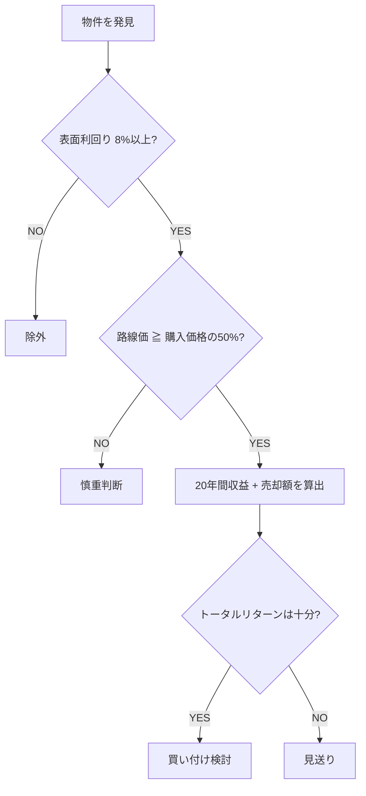

# 図表生成物 — 年収400万円から始める 中古アパート投資の教科書

> 生成日: 2026-02-18 | 総図表数: 12点

---

## fig-1-1: 投資手法別の特徴比較──株・NISA・不動産

**NANO_BANANA_PROMPT:**
```
Subject: 株式投資・NISA・不動産投資の3つの投資手法を比較するインフォグラフィック
Composition: 3列横並びレイアウト（左: 株式投資、中央: NISA、右: 不動産投資）、各列にアイコン＋評価項目を縦に配置
Aspect Ratio: 16:9

Text Integration:
  - Title: "投資手法別の特徴比較" — position: top-center, size: large, weight: bold
  - Column Header 1: "株式投資" — position: top of left column
  - Column Header 2: "NISA（積立）" — position: top of center column
  - Column Header 3: "不動産投資" — position: top of right column
  - Row Labels: "安定収入", "レバレッジ", "暴落リスク", "運用の手間", "実物資産", "20年後リターン" — position: left side of each row
  - Highlight: 不動産投資列に◎マーク多数、他列に△や×
  - Font: bold, large (min 14pt equivalent), sans-serif
  - Language: Japanese

Visual Elements:
  - 株式投資: チャートアイコン（上下するグラフ線）
  - NISA: 積立貯金箱アイコン
  - 不動産投資: アパート建物アイコン（最も大きく描く）
  - 各セルに○/△/×の評価マーク
  - 不動産投資列を薄い青で強調背景

Color Palette: ネイビー (#1B3A5C)、ライトブルー (#4A90D9)、グレー (#888888)、白 (#FFFFFF)、アクセントゴールド (#D4A843)
Background: white
Constraints:
  - Factual: "不動産投資は安定収入・レバレッジ・実物資産の3点で優位"
  - Factual: "NISAの20年リターンは500万円程度"
  - Factual: "不動産投資のリターンは数千万円〜1億円"
  - No small text — all labels must be clearly readable

Prompt:
"Create a clean, flat-design infographic comparing three investment methods side by side. Layout: 3-column horizontal grid, aspect ratio 16:9. Left column '株式投資' with stock chart icon, center column 'NISA（積立）' with piggy bank icon, right column '不動産投資' with apartment building icon (largest). Six comparison rows: '安定収入', 'レバレッジ', '暴落リスク', '運用の手間', '実物資産', '20年後リターン'. Use ◎/○/△/× marks in each cell. Highlight the real estate column with light blue background to show its superiority. Title '投資手法別の特徴比較' at top-center in bold sans-serif. Use navy (#1B3A5C), light blue (#4A90D9), and gold (#D4A843) accent on white background with generous whitespace. All text in Japanese, bold, clearly readable, no small fonts."
```

**Table:**

| 比較項目 | 株式投資 | NISA（積立） | 不動産投資 |
|----------|----------|-------------|-----------|
| 毎月の安定収入 | なし | なし | あり（家賃） |
| レバレッジ（融資） | 不可 | 不可 | 可能 |
| 暴落リスク | 高い | 中程度 | 低い |
| 運用の手間 | 大（デイトレード） | 小 | 小（管理会社委託） |
| 実物資産 | なし（紙資産） | なし | あり（土地） |
| 20年後の期待リターン | 不確実 | 500万円程度 | 数千万円〜1億円 |

---

## fig-1-2: 5,000万円アパート投資の25年間収支シミュレーション

**NANO_BANANA_PROMPT:**
```
Subject: 5,000万円の中古アパート投資が25年間でどのようにリターンを生むかを示す収支フロー
Composition: 上から下への縦フロー。上部に「初期投資 400万円」、中央に25年間の収支の流れ（家賃収入→返済→経費→純収益）、下部に「トータル1億円（17.5倍）」を大きく表示
Aspect Ratio: 4:3

Text Integration:
  - Title: "5,000万円アパート投資の25年間収支" — position: top-center, size: large, weight: bold
  - Start Label: "初期投資 400万円" — position: top-left, inside arrow start box
  - Flow Labels: "家賃 月50万円" → "返済 月23万円" → "経費 月7万円" → "純収益 月20万円"
  - Mid Label: "25年間の累積収益 6,000万円" — position: center
  - End Label: "売却 4,000万円" — position: center-right
  - Result: "トータルリターン 1億円" — position: bottom-center, size: extra-large, weight: bold
  - Multiplier: "約17.5倍" — position: bottom-center, below result, accent color
  - Font: bold, large (min 14pt equivalent), sans-serif
  - Language: Japanese

Visual Elements:
  - 上部: 小さなコイン/札束アイコンで「400万円」を視覚化
  - 中央: 太い下向き矢印で収支フローを表現
  - 下部: 大きなゴールドの円で「1億円」を強調
  - 「17.5倍」をバッジ風に強調表示

Color Palette: ネイビー (#1B3A5C)、ゴールド (#D4A843)、グリーン (#2E8B57)、レッド (#C0392B)、白 (#FFFFFF)
Background: white
Constraints:
  - Factual: "初期投資400万円 → トータルリターン1億円 = 約17.5倍"
  - Factual: "月収50万円 - 返済23万円 - 経費7万円 = 純収益 約20万円"
  - Factual: "25年間累積6,000万円 + 売却4,000万円 = 1億円"
  - Order matters: flow must show input → revenue → costs → profit → total
  - No small text — all labels must be clearly readable

Prompt:
"Create a clean, flat-design infographic showing the 25-year cash flow of a 50-million-yen apartment investment. Layout: vertical flow from top to bottom, aspect ratio 4:3. Start with '初期投資 400万円' at top with small coin icon. Flow downward through revenue breakdown: '家賃 月50万円' minus '返済 月23万円' minus '経費 月7万円' equals '純収益 月20万円'. Show '25年間の累積収益 6,000万円' in the middle section, '売却 4,000万円' branching in. End with a large gold circle at bottom showing 'トータルリターン 1億円' in bold, with '約17.5倍' badge below. Title '5,000万円アパート投資の25年間収支' at top-center in bold sans-serif. Use navy (#1B3A5C), gold (#D4A843), green (#2E8B57) on white background with generous whitespace. All text in Japanese, bold, clearly readable."
```

---

## fig-2-1: 失敗する人の7つの思考・行動パターン

**NANO_BANANA_PROMPT:**
```
Subject: 不動産投資で失敗する人に共通する7つの思考・行動パターンのチェックリスト
Composition: 縦に7項目を並べたチェックリスト形式。左側に番号（1〜7）と×マーク、中央にパターン名、右側に一言まとめ
Aspect Ratio: 4:3

Text Integration:
  - Title: "失敗する人の7つのパターン" — position: top-center, size: large, weight: bold
  - Subtitle: "あなたは当てはまっていませんか？" — position: below title, size: medium
  - Item 1: "❶ 人のせいにする" — "他責マインドで判断力が育たない"
  - Item 2: "❷ 自己分析をしない" — "資産状況を把握せず購入"
  - Item 3: "❸ 目的を決めない" — "所有欲で判断がブレる"
  - Item 4: "❹ マイルストーンを決めない" — "目標なしにフラフラ迷走"
  - Item 5: "❺ 物件情報を先に調べる" — "融資条件を知らない"
  - Item 6: "❻ 金融機関情報を知らない" — "使える銀行を知らず諦める"
  - Item 7: "❼ 出口を決めない" — "売却タイミングを逃す"
  - Font: bold, large (min 14pt equivalent), sans-serif
  - Language: Japanese

Visual Elements:
  - 各項目の左に赤い×マーク（NG行動であることを示す）
  - 各項目を薄い背景色の帯で交互に区別
  - 全体を囲む警告風の枠（薄い赤/オレンジ）
  - 上部にアラートアイコン（⚠️風）

Color Palette: レッド (#C0392B)、オレンジ (#E67E22)、ダークグレー (#333333)、ライトグレー (#F5F5F5)、白 (#FFFFFF)
Background: white
Constraints:
  - Factual: "7つのパターンは番号順に記載"
  - Order matters: 1から7の順序を厳守
  - No small text — all labels must be clearly readable

Prompt:
"Create a clean, flat-design infographic showing a checklist of 7 failure patterns in real estate investing. Layout: vertical list with 7 rows, aspect ratio 4:3. Each row has a red × mark on the left, a pattern name in bold in the center, and a brief explanation on the right. Rows alternate between white and light gray (#F5F5F5) backgrounds. Items in order: '❶ 人のせいにする', '❷ 自己分析をしない', '❸ 目的を決めない', '❹ マイルストーンを決めない', '❺ 物件情報を先に調べる', '❻ 金融機関情報を知らない', '❼ 出口を決めない'. Title '失敗する人の7つのパターン' at top-center in bold sans-serif with a warning icon. Subtle red/orange border around the entire graphic. Use red (#C0392B), orange (#E67E22), dark gray (#333333) on white background with generous whitespace. All text in Japanese, bold, clearly readable."
```

**Table:**

| # | パターン | 一言まとめ |
|---|----------|-----------|
| 1 | 人のせいにする | 他責マインドで判断力が育たない |
| 2 | 自己分析をしない | 資産状況を把握せず購入 |
| 3 | 目的を決めない | 所有欲で判断がブレる |
| 4 | マイルストーンを決めない | 目標なしにフラフラ迷走 |
| 5 | 物件情報を先に調べる | 融資可能な条件を知らない |
| 6 | 金融機関情報を知らない | 使える銀行を知らず諦める |
| 7 | 出口を決めない | 売却タイミングを逃す |

---

## fig-3-1: 木造アパート vs RC（鉄筋コンクリート）投資効率比較

**NANO_BANANA_PROMPT:**
```
Subject: 木造アパートとRC（鉄筋コンクリート）の投資効率を6項目で比較する対決型インフォグラフィック
Composition: 左右対決レイアウト。左に木造アパート（勝者側）、右にRC。中央に比較項目を配置。左側を青（有利）、右側をグレー（不利）で視覚的に差を表現
Aspect Ratio: 16:9

Text Integration:
  - Title: "木造アパート vs RC 投資効率比較" — position: top-center, size: large, weight: bold
  - Left Header: "木造アパート" — position: top-left, with wooden house icon
  - Right Header: "RC（鉄筋コンクリート）" — position: top-right, with concrete building icon
  - Row 1: "購入可能棟数" — Left: "5棟" / Right: "1棟"
  - Row 2: "外壁修繕費" — Left: "100万〜400万円" / Right: "1,000万円超"
  - Row 3: "共用設備" — Left: "ほぼなし" / Right: "エレベーター等"
  - Row 4: "解体費用" — Left: "100万〜200万円" / Right: "2,000万円超"
  - Row 5: "融資" — Left: "幅広い" / Right: "減少傾向"
  - Row 6: "リスク分散" — Left: "5拠点" / Right: "1拠点"
  - Font: bold, large (min 14pt equivalent), sans-serif
  - Language: Japanese

Visual Elements:
  - 左側（木造）: 小さな木造アパートアイコン×5棟
  - 右側（RC）: 大きなRCビルアイコン×1棟
  - 各行で木造側に○/◎、RC側に△/×のマーク
  - 左側の背景を薄いブルー、右側を薄いグレーで塗り分け

Color Palette: ブルー (#4A90D9)、ライトブルー (#E8F0FE)、ダークグレー (#555555)、ライトグレー (#EEEEEE)、白 (#FFFFFF)、アクセントレッド (#C0392B)
Background: white
Constraints:
  - Factual: "1億5,000万円で木造5棟（各3,000万円） vs RC 1棟"
  - Factual: "木造の外壁修繕100万〜400万円、RCは1,000万円超"
  - Factual: "木造の解体100万〜200万円、RCは2,000万円超"
  - All 6 comparison items must be present
  - No small text — all labels must be clearly readable

Prompt:
"Create a clean, flat-design versus infographic comparing wooden apartments and RC (reinforced concrete) buildings for investment efficiency. Layout: left-right battle format, aspect ratio 16:9. Left side '木造アパート' with 5 small wooden house icons on light blue (#E8F0FE) background, right side 'RC（鉄筋コンクリート）' with 1 large concrete building icon on light gray (#EEEEEE) background. Six comparison rows in the center: '購入可能棟数' (5棟 vs 1棟), '外壁修繕費' (100万〜400万円 vs 1,000万円超), '共用設備' (ほぼなし vs エレベーター等), '解体費用' (100万〜200万円 vs 2,000万円超), '融資' (幅広い vs 減少傾向), 'リスク分散' (5拠点 vs 1拠点). Use ◎/○ marks for wooden side, △/× for RC side. Title '木造アパート vs RC 投資効率比較' at top-center in bold sans-serif. Use blue (#4A90D9), dark gray (#555555), accent red (#C0392B) on white background. All text in Japanese, bold, clearly readable."
```

**Table:**

| 比較項目 | 木造アパート | RC（鉄筋コンクリート） |
|----------|------------|---------------------|
| 1億5,000万円で買える棟数 | 5棟（各3,000万円） | 1棟 |
| 外壁修繕費 | 100万〜400万円 | 1,000万円超 |
| 共用設備 | ほぼなし | エレベーター、給水ポンプ等 |
| 解体費用 | 100万〜200万円 | 2,000万円超 |
| 融資のしやすさ | 幅広い金融機関が対応 | 対応金融機関が減少傾向 |
| リスク分散 | 5拠点に分散可能 | 1拠点に集中 |

---

## fig-4-1: ポータルサイト別の特徴と使い分け

**NANO_BANANA_PROMPT:**
```
Subject: 不動産投資ポータルサイト4種類の特徴と使い分けを示すカード型インフォグラフィック
Composition: 2×2グリッドレイアウト。各サイトを1カードとして配置。各カードにサイト名・特徴・用途・対象レベルを記載
Aspect Ratio: 4:3

Text Integration:
  - Title: "ポータルサイト別の特徴と使い分け" — position: top-center, size: large, weight: bold
  - Card 1: "楽待" — "最大手・提案機能あり" — "初心者の入り口" — position: top-left
  - Card 2: "健美家" — "実務的検索・エリアレポート" — "利回り重視の絞り込み" — position: top-right
  - Card 3: "スーモ/ホームズ" — "居住用として掲載" — "ボロ戸建て探しの穴場" — position: bottom-left
  - Card 4: "不動産会社自社サイト" — "ポータル掲載前の先行情報" — "競争の少ない物件発掘" — position: bottom-right
  - Level badges: "初心者〜" or "中級〜" in each card corner
  - Font: bold, large (min 14pt equivalent), sans-serif
  - Language: Japanese

Visual Elements:
  - 各カードに異なるアクセントカラーの左ボーダー
  - サイト名は大きく太字
  - 対象レベルを小さなバッジで表示
  - 各カードにシンプルなウェブサイトアイコン

Color Palette: ネイビー (#1B3A5C)、ブルー (#4A90D9)、グリーン (#2E8B57)、オレンジ (#E67E22)、ライトグレー (#F5F5F5)、白 (#FFFFFF)
Background: white
Constraints:
  - Factual: "楽待は最大手"
  - Factual: "4つのサイトカテゴリが存在"
  - All 4 cards must be present
  - No small text — all labels must be clearly readable

Prompt:
"Create a clean, flat-design infographic showing 4 real estate portal sites in a 2x2 card grid. Layout: 2x2 grid, aspect ratio 4:3. Top-left card '楽待' (navy accent border) — '最大手・提案機能あり', '初心者〜' badge. Top-right card '健美家' (blue accent) — '実務的検索・エリアレポート', '中級〜' badge. Bottom-left card 'スーモ/ホームズ' (green accent) — '居住用として掲載、ボロ戸建ての穴場', '初心者〜' badge. Bottom-right card '不動産会社自社サイト' (orange accent) — 'ポータル掲載前の先行情報', '中級〜' badge. Title 'ポータルサイト別の特徴と使い分け' at top-center in bold sans-serif. Use navy (#1B3A5C), blue (#4A90D9), green (#2E8B57), orange (#E67E22) on white background. All text in Japanese, bold, clearly readable."
```

---

## fig-4-2: 物件評価フロー──収益と資産のトータルで判断する

**NANO_BANANA_PROMPT:**
```
Subject: 中古アパートの物件評価フローチャート（利回り→土地値→トータルリターンの3段階判定）
Composition: 上から下への縦フロー。各判定ノードはひし形（YES/NOの分岐）、行動ノードは角丸四角形
Aspect Ratio: 4:3

Text Integration:
  - Title: "物件評価フロー" — position: top-center, size: large, weight: bold
  - Node 1: "物件を発見" — position: top, rounded rectangle
  - Decision 1: "表面利回り 8%以上？" — position: below node 1, diamond shape
  - Branch NO: "除外" — position: right of decision 1, red
  - Branch YES → Decision 2: "路線価 ≧ 購入価格の50%？" — diamond shape
  - Branch NO: "慎重判断" — position: right of decision 2, orange
  - Branch YES → Node 2: "20年間収益 + 売却額を算出" — rounded rectangle
  - Decision 3: "トータルリターンは十分？" — diamond shape
  - Branch YES: "買い付け検討" — position: below, green, large
  - Branch NO: "見送り" — position: right, gray
  - Font: bold, large (min 14pt equivalent), sans-serif
  - Language: Japanese

Visual Elements:
  - 判定ノード（ひし形）はブルー背景
  - 行動ノード（角丸四角形）はライトグレー背景
  - YES矢印はグリーン、NO矢印はレッド
  - 最終「買い付け検討」を大きく強調

Color Palette: ブルー (#4A90D9)、グリーン (#2E8B57)、レッド (#C0392B)、オレンジ (#E67E22)、ライトグレー (#F5F5F5)、白 (#FFFFFF)
Background: white
Constraints:
  - Factual: "3段階の判定: 利回り → 土地値 → トータルリターン"
  - Factual: "利回り基準は8%以上"
  - Factual: "土地値基準は購入価格の50%以上"
  - Order matters: flow must proceed top to bottom in specified sequence
  - No small text — all labels must be clearly readable

Prompt:
"Create a clean, flat-design flowchart infographic for evaluating apartment investment properties. Layout: top-to-bottom vertical flow, aspect ratio 4:3. Start with rounded rectangle '物件を発見' at top. First diamond decision node '表面利回り 8%以上？' — NO branch goes right to red '除外', YES branch goes down to second diamond '路線価 ≧ 購入価格の50%？' — NO goes right to orange '慎重判断', YES goes down to rounded rectangle '20年間収益 + 売却額を算出'. Third diamond 'トータルリターンは十分？' — YES goes down to large green '買い付け検討', NO goes right to gray '見送り'. Decision nodes in blue (#4A90D9), YES arrows in green (#2E8B57), NO arrows in red (#C0392B). Title '物件評価フロー' at top-center in bold sans-serif on white background. All text in Japanese, bold, clearly readable."
```

**Mermaid:**


---

## fig-5-1: 年収別に使える金融機関と融資戦略

**NANO_BANANA_PROMPT:**
```
Subject: 年収帯別（2,000万円〜フリーランス）に使える金融機関と融資戦略を階段状に示すインフォグラフィック
Composition: 左側に年収帯を上から下へ階段状に配置（高い順→低い順）。各段に使える金融機関と戦略を記載。階段が下がるにつれて色が変わる（ゴールド→ブルー→グリーン）
Aspect Ratio: 16:9

Text Integration:
  - Title: "年収別に使える金融機関と融資戦略" — position: top-center, size: large, weight: bold
  - Step 1: "年収2,000万円以上" — "メガバンク・地方銀行" — "大規模RC・新築でフルローン"
  - Step 2: "年収1,000万円以上" — "地方銀行" — "中規模アパートでフルローン"
  - Step 3: "年収700万円以上" — "地方銀行・アパートローン" — "新築アパート+アパートローン"
  - Step 4: "年収500万円前後" — "信用金庫・信用組合・ノンバンク" — "物件の資産価値重視で突破"
  - Step 5: "フリーランス等" — "信用組合・ノンバンク" — "小戸建てから実績を積む"
  - Highlight: Step 4 を強調枠で囲む（本書のメインターゲット）
  - Font: bold, large (min 14pt equivalent), sans-serif
  - Language: Japanese

Visual Elements:
  - 階段状のステップ（上から下へ）
  - 各ステップに銀行/金融機関のシンプルなアイコン
  - Step 4「年収500万円前後」に「← 本書のターゲット」のバッジ
  - 矢印で「ここから始める！」を示す

Color Palette: ゴールド (#D4A843)、ネイビー (#1B3A5C)、ブルー (#4A90D9)、グリーン (#2E8B57)、ライトグレー (#F5F5F5)、白 (#FFFFFF)
Background: white
Constraints:
  - Factual: "5段階の年収帯: 2,000万円以上 → 1,000万円以上 → 700万円以上 → 500万円前後 → フリーランス"
  - Factual: "年収500万円前後は信用金庫・信用組合・ノンバンクを使う"
  - Order matters: top to bottom, highest income first
  - No small text — all labels must be clearly readable

Prompt:
"Create a clean, flat-design staircase infographic showing financing strategies by income level. Layout: descending staircase from top-left to bottom-right, aspect ratio 16:9. Five steps from highest to lowest income: '年収2,000万円以上' (gold accent, メガバンク・地方銀行), '年収1,000万円以上' (navy accent, 地方銀行), '年収700万円以上' (blue accent, 地方銀行・アパートローン), '年収500万円前後' (green accent with highlight border and '← 本書のターゲット' badge, 信用金庫・信用組合・ノンバンク), 'フリーランス等' (gray accent, 信用組合・ノンバンク). Each step shows income level, available banks, and strategy. Title '年収別に使える金融機関と融資戦略' at top-center in bold sans-serif. Use gold (#D4A843), navy (#1B3A5C), blue (#4A90D9), green (#2E8B57) on white background. All text in Japanese, bold, clearly readable."
```

**Table:**

| 年収帯 | 使える金融機関 | 主な戦略 |
|--------|--------------|----------|
| 2,000万円以上 | メガバンク、地方銀行 | 大規模RC・新築でフルローン |
| 1,000万円以上 | 地方銀行 | 中規模アパートでフルローン |
| 700万円以上 | 地方銀行、アパートローン | 新築アパート+アパートローン活用 |
| 500万円前後 | 信用金庫、信用組合、ノンバンク | 物件の資産価値重視で突破 |
| フリーランス等 | 信用組合、ノンバンク | 小戸建てから実績を積む |

---

## fig-6-1: ターゲット別コンセプト設計の考え方

※ 原稿内では fig-6-1 として配置（QA修正で番号入れ替え済み）

**NANO_BANANA_PROMPT:**
```
Subject: 賃貸アパートの空室対策として3つのターゲット層別にコンセプトを設計する概念図
Composition: 中央に「コンセプト設計」の核、そこから3方向に放射状に3つのターゲット層が伸びる。各ターゲットにキーワードと施策例を添える
Aspect Ratio: 16:9

Text Integration:
  - Title: "ターゲット別コンセプト設計" — position: top-center, size: large, weight: bold
  - Center: "コンセプト設計" — position: center, inside circle
  - Branch 1: "ファミリー層" — "子供が喜ぶ暮らし" — "人工芝+BBQ、公園情報" — position: upper-left
  - Branch 2: "若いカップル" — "おしゃれに暮らせる空間" — "間接照明、ダブルベッド対応" — position: upper-right
  - Branch 3: "男性シングル" — "クールでかっこいい空間" — "ダクトレール照明、コンクリート調クロス" — position: bottom-center
  - Font: bold, large (min 14pt equivalent), sans-serif
  - Language: Japanese

Visual Elements:
  - 中央に大きな円（ハブ）
  - 3本の太い矢印が放射状に伸びる
  - 各ターゲットのエリアに関連するシンプルなアイコン（家族シルエット、カップルシルエット、男性シルエット）
  - 各施策をタグ風の小さなカードで表現

Color Palette: ネイビー (#1B3A5C)、ピンク (#E91E63)、ブルー (#4A90D9)、グリーン (#2E8B57)、ライトグレー (#F5F5F5)、白 (#FFFFFF)
Background: white
Constraints:
  - Factual: "3つのターゲット層: ファミリー層、若いカップル、男性シングル"
  - Factual: "コンセプトとターゲットの一致が空室対策の核心"
  - All 3 target segments must be present with their specific examples
  - No small text — all labels must be clearly readable

Prompt:
"Create a clean, flat-design radial infographic showing apartment vacancy strategy through target-based concept design. Layout: central hub with 3 radiating branches, aspect ratio 16:9. Center circle labeled 'コンセプト設計'. Upper-left branch: 'ファミリー層' (green, family silhouette icon) — keyword '子供が喜ぶ暮らし' — tags '人工芝+BBQ', '公園情報'. Upper-right branch: '若いカップル' (pink, couple silhouette icon) — keyword 'おしゃれに暮らせる空間' — tags '間接照明', 'ダブルベッド対応'. Bottom-center branch: '男性シングル' (blue, male silhouette icon) — keyword 'クールでかっこいい空間' — tags 'ダクトレール照明', 'コンクリート調クロス'. Title 'ターゲット別コンセプト設計' at top-center in bold sans-serif. Use navy (#1B3A5C), pink (#E91E63), blue (#4A90D9), green (#2E8B57) on white background. All text in Japanese, bold, clearly readable."
```

**Table:**

| ターゲット | コンセプトのキーワード | 具体的な施策例 |
|-----------|---------------------|---------------|
| ファミリー層 | 子供が喜ぶ暮らし | 人工芝+BBQスペース、公園情報 |
| 若いカップル | おしゃれに暮らせる空間 | 間接照明、ダブルベッド対応、美容院情報 |
| 男性シングル | クールでかっこいい空間 | ダクトレール照明、コンクリート調クロス |

---

## fig-6-2: 中古アパート1棟の収支モデル（2,500万円・利回り約10%）

※ 原稿内では fig-6-2 として配置（QA修正で番号入れ替え済み）

**NANO_BANANA_PROMPT:**
```
Subject: 2,500万円の中古アパート1棟の収支モデルを示すインフォグラフィック（月次収支+20年トータル）
Composition: 上下2段構成。上段: 月次収支フロー（家賃→返済→経費→利益）。下段: 20年間のトータルリターン（累積収益+土地残存価値）
Aspect Ratio: 4:3

Text Integration:
  - Title: "中古アパート1棟の収支モデル" — position: top-center, size: large, weight: bold
  - Subtitle: "購入価格 2,500万円・利回り約10%" — position: below title
  - Upper Section Title: "毎月の収支" — position: upper-left
  - Flow: "家賃 月24万円" → "返済 月12万円" → "経費 月4万円" → "利益 月8万円"
  - Lower Section Title: "20年間のトータル" — position: lower-left
  - Items: "累積収益 1,920万円" + "土地の残存価値 2,500万円" = "トータルリターン 4,420万円"
  - Bottom Note: "初期投資（諸費用）約200万円" — position: bottom-right, small
  - Font: bold, large (min 14pt equivalent), sans-serif
  - Language: Japanese

Visual Elements:
  - 上段: 左から右への矢印フロー（家賃→返済→経費→利益）
  - 家賃を大きなグリーンのバー、返済をレッドのバー、経費をオレンジのバー、利益をブルーのバー
  - 下段: 積み上げ式の図（累積収益＋土地価値）
  - 「4,420万円」を大きなゴールド文字で強調

Color Palette: ネイビー (#1B3A5C)、グリーン (#2E8B57)、レッド (#C0392B)、オレンジ (#E67E22)、ゴールド (#D4A843)、ライトグレー (#F5F5F5)、白 (#FFFFFF)
Background: white
Constraints:
  - Factual: "月24万円 - 月12万円 - 月4万円 = 月8万円の利益"
  - Factual: "年間96万円 × 20年 = 1,920万円"
  - Factual: "1,920万円 + 2,500万円（土地値） = 4,420万円"
  - Factual: "初期投資は約200万円"
  - No small text — all labels must be clearly readable

Prompt:
"Create a clean, flat-design infographic showing the financial model of a single used apartment building (25 million yen). Layout: two-section vertical, aspect ratio 4:3. Upper section '毎月の収支': horizontal bar flow from left to right — green bar '家賃 月24万円', red bar '返済 月12万円', orange bar '経費 月4万円', resulting in blue bar '利益 月8万円'. Lower section '20年間のトータル': stacked visualization — '累積収益 1,920万円' plus '土地の残存価値 2,500万円' equals large gold text 'トータルリターン 4,420万円'. Small note '初期投資 約200万円' at bottom-right. Title '中古アパート1棟の収支モデル' at top-center, subtitle '購入価格 2,500万円・利回り約10%' below. Use navy (#1B3A5C), green (#2E8B57), red (#C0392B), gold (#D4A843) on white background. All text in Japanese, bold, clearly readable."
```

**Table:**

| 項目 | 数値 |
|------|------|
| 購入価格 | 2,500万円（フルローン） |
| 家賃収入 | 月24万円（6室×4万円） |
| ローン返済 | 月12万円 |
| 経費 | 月4万円 |
| 毎月の利益 | 8万円 |
| 年間利益 | 96万円 |
| 20年間の累積収益 | 1,920万円 |
| 土地の残存価値 | 2,500万円 |
| **トータルリターン** | **4,420万円** |
| 初期投資（諸費用） | 約200万円 |

---

## fig-7-1: ゼロから月100万円達成のロードマップ

**NANO_BANANA_PROMPT:**
```
Subject: 不動産投資でゼロから月100万円の不労所得を達成する3フェーズのロードマップ
Composition: 左から右への水平タイムライン。3つのフェーズを段階的に上昇する階段またはステップで表現。各フェーズに期間・目標・金融機関・物件タイプ・棟数を記載
Aspect Ratio: 16:9

Text Integration:
  - Title: "ゼロから月100万円達成のロードマップ" — position: top-center, size: large, weight: bold
  - Phase 1: "前半戦" — "1〜2年目" — "月10万〜20万円" — "アパートローン" — "1〜2棟" — position: left
  - Phase 2: "中盤戦" — "3〜5年目" — "月30万〜60万円" — "信用金庫・信用組合" — "3〜5棟" — position: center
  - Phase 3: "後半戦" — "5〜7年目" — "月60万〜100万円" — "プロパー融資・法人融資" — "7〜10棟" — position: right
  - Goal: "月100万円達成！" — position: right-end, with star/flag icon
  - Font: bold, large (min 14pt equivalent), sans-serif
  - Language: Japanese

Visual Elements:
  - 左から右への上昇カーブまたは階段
  - 各フェーズを異なる色のブロックで表現
  - フェーズ間を太い矢印で接続
  - 右端にゴールの旗/星アイコン
  - 各フェーズにアパートアイコン（数が増えていく: 1棟→3棟→7棟）

Color Palette: グリーン (#2E8B57)、ブルー (#4A90D9)、ゴールド (#D4A843)、ネイビー (#1B3A5C)、ライトグレー (#F5F5F5)、白 (#FFFFFF)
Background: white
Constraints:
  - Factual: "前半戦: 1〜2年目、月10万〜20万円、1〜2棟"
  - Factual: "中盤戦: 3〜5年目、月30万〜60万円、3〜5棟"
  - Factual: "後半戦: 5〜7年目、月60万〜100万円、7〜10棟"
  - Order matters: left to right, Phase 1 → Phase 2 → Phase 3
  - No small text — all labels must be clearly readable

Prompt:
"Create a clean, flat-design roadmap infographic showing 3 phases to achieve 1 million yen monthly passive income from real estate. Layout: horizontal ascending staircase from left to right, aspect ratio 16:9. Phase 1 '前半戦' (green block, left): '1〜2年目', '月10万〜20万円', 'アパートローン', 1-2 small building icons. Phase 2 '中盤戦' (blue block, center): '3〜5年目', '月30万〜60万円', '信用金庫・信用組合', 3-5 building icons. Phase 3 '後半戦' (gold block, right): '5〜7年目', '月60万〜100万円', 'プロパー融資・法人融資', 7-10 building icons. Thick arrows connecting phases. Goal flag/star icon at right end labeled '月100万円達成！'. Title 'ゼロから月100万円達成のロードマップ' at top-center in bold sans-serif. Use green (#2E8B57), blue (#4A90D9), gold (#D4A843), navy (#1B3A5C) on white background. All text in Japanese, bold, clearly readable."
```

**Table:**

| フェーズ | 期間目安 | 月利益目標 | 主な金融機関 | 主な物件タイプ | 棟数目安 |
|----------|----------|-----------|------------|--------------|---------|
| 前半戦 | 1〜2年目 | 月10万〜20万円 | アパートローン、不動産担保ローン | 新築AP・中古AP・ボロ戸建て | 1〜2棟 |
| 中盤戦 | 3〜5年目 | 月30万〜60万円 | 信用金庫、信用組合 | 中古アパート中心 | 3〜5棟 |
| 後半戦 | 5〜7年目 | 月60万〜100万円 | プロパー融資、法人融資 | 中古AP+新築AP | 7〜10棟 |

---

## fig-8-1: 新築アパートの収益フロー（30年間）

**NANO_BANANA_PROMPT:**
```
Subject: 新築アパートの30年間の収益推移を時間軸で示すフロー図（黒字→低下→赤字→大黒字の4フェーズ）
Composition: 左から右への水平タイムライン。収益の上下をグラフ的な曲線で表現。4つの期間ゾーンに分け、各ゾーンの収益状態を色分け
Aspect Ratio: 16:9

Text Integration:
  - Title: "新築アパートの収益フロー（30年間）" — position: top-center, size: large, weight: bold
  - Zone 1: "0〜10年" — "新築プレミアム" — "黒字 月7〜10万円" — position: left, green zone
  - Zone 2: "10〜20年" — "家賃下落・修繕開始" — "収益性低下" — position: center-left, yellow zone
  - Zone 3: "20〜25年" — "大規模修繕" — "赤字の可能性" — position: center-right, red zone
  - Zone 4: "25年〜" — "残債ゼロ" — "大黒字 月25万円" — position: right, gold zone
  - Y-axis label: "収益" — position: left edge
  - X-axis label: "年数" — position: bottom edge
  - Font: bold, large (min 14pt equivalent), sans-serif
  - Language: Japanese

Visual Elements:
  - 収益カーブ: 前半は高め→中盤でゆるやかに下降→後半で一時的にマイナス→残債ゼロ後に急上昇
  - 各ゾーンを色付き背景で区分（グリーン→イエロー→レッド→ゴールド）
  - 「残債ゼロ」のポイントにスターマーク
  - ゼロラインを点線で表示

Color Palette: グリーン (#2E8B57)、イエロー (#F1C40F)、レッド (#C0392B)、ゴールド (#D4A843)、ネイビー (#1B3A5C)、ライトグレー (#F5F5F5)、白 (#FFFFFF)
Background: white
Constraints:
  - Factual: "前半0〜10年は黒字（月7〜10万円）"
  - Factual: "中盤10〜20年は収益性低下"
  - Factual: "後半20〜25年は赤字の可能性"
  - Factual: "残債ゼロ後（25年〜）は大黒字（月25万円）"
  - Order matters: 4 zones must appear left to right in chronological order
  - No small text — all labels must be clearly readable

Prompt:
"Create a clean, flat-design timeline infographic showing the 30-year revenue flow of a new apartment building. Layout: horizontal timeline with revenue curve, aspect ratio 16:9. Four color-coded zones from left to right: Zone 1 '0〜10年' (green background) — '新築プレミアム' — '黒字 月7〜10万円', revenue curve stays high. Zone 2 '10〜20年' (yellow background) — '家賃下落・修繕開始' — '収益性低下', curve descends. Zone 3 '20〜25年' (red background) — '大規模修繕' — '赤字の可能性', curve dips below zero line. Zone 4 '25年〜' (gold background) — '残債ゼロ' — '大黒字 月25万円', curve surges upward with star mark at '残債ゼロ' point. Dashed zero line across the chart. Title '新築アパートの収益フロー（30年間）' at top-center in bold sans-serif. Use green (#2E8B57), yellow (#F1C40F), red (#C0392B), gold (#D4A843) on white background. All text in Japanese, bold, clearly readable."
```

**Table:**

| 期間 | 状態 | 収益イメージ |
|------|------|-------------|
| 前半0〜10年 | 新築プレミアム家賃で安定 | 黒字（月7〜10万円） |
| 中盤10〜20年 | 家賃下落、修繕開始 | 収益性低下 |
| 後半20〜25年 | 大規模修繕、赤字リスク | 赤字の可能性 |
| 残債ゼロ後（25年〜） | 経費のみ | 大黒字（月25万円） |

---

## fig-8-2: 新築+中古+ボロ戸建てのポートフォリオ例

**NANO_BANANA_PROMPT:**
```
Subject: 新築アパート・中古アパート・ボロ戸建ての3種を組み合わせた不動産ポートフォリオ例（合計月47万円）
Composition: 中央に円グラフまたはドーナツチャートで月利益の内訳を表示。周囲に3つの物件タイプの詳細カード。下部に合計を大きく表示
Aspect Ratio: 4:3

Text Integration:
  - Title: "新築+中古+ボロ戸建てのポートフォリオ例" — position: top-center, size: large, weight: bold
  - Center Chart Labels: "14万円", "25万円", "8万円"
  - Card 1: "新築アパート" — "2棟" — "月14万円" — "守り（安定CF）" — position: upper-left
  - Card 2: "中古アパート" — "3棟" — "月25万円" — "攻め（高利回り）" — position: upper-right
  - Card 3: "ボロ戸建て" — "2棟" — "月8万円" — "分散" — position: bottom-left
  - Total: "合計 7棟 月47万円" — position: bottom-center, size: extra-large, weight: bold
  - Badge: "攻守バランス型" — position: near total
  - Font: bold, large (min 14pt equivalent), sans-serif
  - Language: Japanese

Visual Elements:
  - ドーナツチャート（3セグメント: 新築=ブルー、中古=グリーン、ボロ戸建て=オレンジ）
  - 各物件タイプのカードにシンプルな建物アイコン（新築=きれいなアパート、中古=少し古びたアパート、ボロ戸建て=小さな戸建て）
  - 合計部分をゴールド背景で強調

Color Palette: ブルー (#4A90D9)、グリーン (#2E8B57)、オレンジ (#E67E22)、ゴールド (#D4A843)、ネイビー (#1B3A5C)、ライトグレー (#F5F5F5)、白 (#FFFFFF)
Background: white
Constraints:
  - Factual: "新築2棟 月14万円 + 中古3棟 月25万円 + ボロ戸建て2棟 月8万円 = 合計7棟 月47万円"
  - Factual: "新築=守り、中古=攻め、ボロ戸建て=分散"
  - All 3 property types must be present with correct numbers
  - No small text — all labels must be clearly readable

Prompt:
"Create a clean, flat-design portfolio infographic combining three types of real estate investment properties. Layout: donut chart in center with 3 detail cards around it, aspect ratio 4:3. Center donut chart shows revenue breakdown: blue segment '新築アパート 14万円', green segment '中古アパート 25万円', orange segment 'ボロ戸建て 8万円'. Upper-left card: '新築アパート' with clean building icon — '2棟', '月14万円', '守り（安定CF）'. Upper-right card: '中古アパート' with older building icon — '3棟', '月25万円', '攻め（高利回り）'. Bottom-left card: 'ボロ戸建て' with small house icon — '2棟', '月8万円', '分散'. Large gold-background banner at bottom: '合計 7棟 月47万円 — 攻守バランス型'. Title '新築+中古+ボロ戸建てのポートフォリオ例' at top-center in bold sans-serif. Use blue (#4A90D9), green (#2E8B57), orange (#E67E22), gold (#D4A843) on white background. All text in Japanese, bold, clearly readable."
```

**Table:**

| 物件タイプ | 棟数 | 月利益 | 役割 |
|-----------|------|--------|------|
| 新築アパート | 2棟 | 14万円 | 安定キャッシュフロー（守り） |
| 中古アパート | 3棟 | 25万円 | 高利回りで収益の柱（攻め） |
| ボロ戸建て | 2棟 | 8万円 | 小さな収入源の分散 |
| **合計** | **7棟** | **47万円** | **攻守バランス型** |

---

## 生成サマリー

| ID | キャプション | Mermaid | Table | Nano Banana |
|----|-------------|---------|-------|-------------|
| fig-1-1 | 投資手法別の特徴比較──株・NISA・不動産 | 無 | 有 | 有 |
| fig-1-2 | 5,000万円アパート投資の25年間収支シミュレーション | 無 | 有 | 有 |
| fig-2-1 | 失敗する人の7つの思考・行動パターン | 無 | 有 | 有 |
| fig-3-1 | 木造アパート vs RC 投資効率比較 | 無 | 有 | 有 |
| fig-4-1 | ポータルサイト別の特徴と使い分け | 無 | 有 | 有 |
| fig-4-2 | 物件評価フロー | 有 | 無 | 有 |
| fig-5-1 | 年収別に使える金融機関と融資戦略 | 無 | 有 | 有 |
| fig-6-1 | ターゲット別コンセプト設計の考え方 | 無 | 有 | 有 |
| fig-6-2 | 中古アパート1棟の収支モデル | 無 | 有 | 有 |
| fig-7-1 | ゼロから月100万円達成のロードマップ | 無 | 有 | 有 |
| fig-8-1 | 新築アパートの収益フロー（30年間） | 無 | 有 | 有 |
| fig-8-2 | 新築+中古+ボロ戸建てのポートフォリオ例 | 無 | 有 | 有 |
